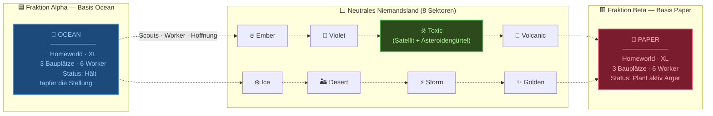
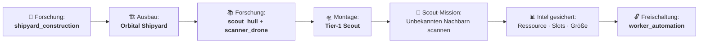
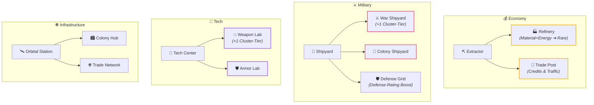

<div align="center">


<br/>

<table>
<tr>
<td align="center" width="100%">
<br/>
<samp>
<b>SNIPWAR — EISEN-GRENZE</b><br/>
STRATEGISCHE OVERWORLD · 10 WELTEN · 17 PREFLIGHT-GITTER · 0 SICHERE ORBITS
</samp>
<br/><br/>
</td>
</tr>
</table>

[](https://godotengine.org/)
[](#-lagezentrum--frontbericht)
[-ef476f?style=for-the-badge)](#-die-zehn-welten--feldkarte)
[](#-automatisierte-pruefsequenz)
[](#)

</div>

---

<div align="center">

<table>
<tr>
<td align="center" bgcolor="#0d1117" style="border: 1px solid #30363d; padding: 24px; border-radius: 8px;">

```
▓▓▓▓▓▓▓▓▓▓▓▓▓▓▓▓▓▓▓▓▓▓▓▓▓▓▓▓▓▓▓▓▓▓▓▓▓▓▓▓▓▓▓▓▓▓▓▓▓▓▓▓▓▓▓▓▓▓▓▓
▓                                                          ▓
▓   EINGEHENDE TRANSMISSION // KANAL 7-DELTA               ▓
▓   HERKUNFT: EISEN-GRENZE · SEKTOR [REDACTED]             ▓
▓   VERSCHLÜSSELUNG: KEINE (Zu teuer in der Anschaffung)   ▓
▓                                                          ▓
▓▓▓▓▓▓▓▓▓▓▓▓▓▓▓▓▓▓▓▓▓▓▓▓▓▓▓▓▓▓▓▓▓▓▓▓▓▓▓▓▓▓▓▓▓▓▓▓▓▓▓▓▓▓▓▓▓▓▓▓
```

*„Die Galaxie hat zehn Welten. Zwei davon bilden sich ein, wichtig zu sein.*<br/>
*Der Rest hat keine Meinung — noch nicht.“*

</td>
</tr>
</table>

</div>

---

## 📡 TRANSMISSION-LOG // EINTRAG 001

> **AN:** Oberkommando & wer auch immer gerade die Konsole bewacht  
> **VON:** Einsatzleitung, Frontier-Basis *Ocean*  
> **BETREFF:** Lagebericht Eisen-Grenze. Bitte lesen, ignorieren, später bereuen.

Die **Eisen-Grenze** ist kein romantischer Name. Jemand hat die Karte gesehen, die Ressourcenverteilung berechnet und beschlossen, dass *„Hoffnungslos“* als Codename zu wenig Budget bewilligt bekommt.

Zehn Welten. Fünf Rohstoffe. Zwei Fraktionen mit ausgeprägter Antipathie — und acht neutrale Planeten, die den großen Fehler begangen haben, genau im Transitkorridor zu liegen.

Die strategische Lage ist simpel: **Wer das Waypoint-Netz kontrolliert, bestimmt den Ressourcenstrom. Wer den Strom kontrolliert, baut Schiffe. Wer Schiffe hat, behauptet im Nachhinein, das Ganze sei ein genialer Masterplan gewesen.**

Aktuell sind wir bei Schritt eins: Hoffen, dass die Worker nicht auf halbem Weg umdrehen.

---

## 🪐 DIE ZEHN WELTEN — Feldkarte & Sektorstatus



> [!NOTE]
> Das Routing erfolgt über **Moon- und Comet-Waypoints** (Layout-Nachbarschaft) plus KNN-Langstreckenkanten (`NavigationField`). AStar2D wählt den kürzesten Pfad.

<details>
<summary>📐 <b>Klassifizierungsdaten der Welten (Seed-deterministische Profile)</b></summary>

| Klasse | Profil | Spawn-Intervall | Basis-Garnison | Bauplätze | Ressourcenbasis |
|:---:|:---:|:---:|:---:|:---:|:---:|
| **XL** | `extra_large` | 5.0 s (3 Einheiten) | 6 Worker | 3 Slots | 3× Multiplikator |
| **L** | `large` | 7.0 s (2 Einheiten) | 4 Worker | 2 Slots | 2× Multiplikator |
| **Variable** | `variable` | 10.0 s (1 Einheit) | 2 Worker | 1 Slot | 1× Multiplikator |

*Hinweis:* Der Worker-Spawntimer existiert auf jedem Planeten, bleibt aber **inaktiv**, bis die Technologie `worker_automation` erforscht und eine Worker-Fabrik errichtet wurde.

</details>

---

## ⚡ RESSOURCENLAGEBERICHT — Die 5 Säulen des Vaults

<div align="center">

| | Rohstoff | Strategischer Nutzen | Lageeinschätzung |
|:---:|:---|:---|:---|
| ⚡ | **Energy** | Werftbau, Scanner-Drohnen, Betrieb | Ohne Energie steht alles. Mit ihr explodiert fast alles. |
| 🌿 | **Biomass** | Worker-Automation & Kolonisation | Klang nach Gewächshaus. Ist aber Flottentreibstoff. |
| 💠 | **Rare** | Planetares Vermessungswesen | Selten. Teuer. Niemand weiß, woraus es besteht. |
| 🧪 | **Volatile** | Waffensysteme & Layer-3-Chassis | Hochexplosiv. Bitte nicht schütteln. |
| 🔩 | **Material** | Rümpfe, Planeten-Extraktoren, Werften | Schiffe bauen sich nicht von selbst. Noch nicht. |

</div>

> [!IMPORTANT]
> **Ressourcen sind globale `GameResource`-Objekte aus dem `ResourcePool`:**  
> Homeworlds erhalten garantierte *unterschiedliche* Ressourcen; der Rest wird seed-deterministisch per Round-Robin aufgeteilt.  
> Das Faction-Vault verfügt über strikten **Overdraft-Schutz**: `spend_faction_resource()` blockiert unbezahlbare Vorhaben sofort.

---

## 🚀 EXPEDITION & SCHIFFSBAU — Vom Scout zur Flotte

> *„Wir haben einen modularen Schiffs-Hangar. Er montiert Rümpfe, Antriebe, Waffen, Schilde und Scanner. Die meisten Schiffe fliegen aktuell nur im Menü — aber sie tun es mit Stil.“*



### Der Technologie-Katalog (8 verifizierte Doktrinen)

| Kategorie | Technologie | Kosten | Effekt / Freischaltung |
|:---|:---|:---|:---|
| 🚀 **Ships** | `shipyard_construction` | 10 Energy | Schaltet Werft-Upgrade im Planetennetz frei |
| 🚀 **Ships** | `scout_hull` | 15 Material | Leichter Tier-1 Aufklärungsrumpf |
| 🚀 **Ships** | `scanner_drone` | 10 Energy | Scout deckt intel-gesicherte Planeten auf |
| 🚀 **Ships** | `weapon_systems` | 12 Volatile | Schaltet Bordwaffen & T2-Mehrzweckrumpf frei |
| 🚀 **Ships** | `worker_automation` | 15 Biomass | *(Gated by Discovery)* Erste Worker-Fabrik baubar |
| 🤖 **Mech** | `mech_frame` | 25 Volatile | T1-Chassis für Bodenoperationen (Layer 3) |
| 🪐 **Planet** | `planetary_survey` | 10 Rare | Steigert Planetenproduktion auf 125 % |
| 🪐 **Planet** | `planetary_extraction` | 20 Material | Baut Survey aus: Produktion auf 150 % |

---

## 🏗️ INFRASTRUKTUR-DOKTRIN — 13 Planeten-Upgrades in 4 Zweigen



*Upgrades mit Exklusivität:* `refinery` ⮂ `trade_post` | `war_shipyard` ⮂ `colony_shipyard` | `weapon_lab` ⮂ `armor_lab`.

---

## 🛤️ TRANSIT & LOGISTIK — Die Physik der Eisen-Grenze

```
Flugzeit = (Distanz / 100) × 8.0 × (1.0 + 0.05 × √(max(Einheiten − 1, 0)))
		   ÷ Transfer-Geschwindigkeitsmultiplikator der Quelle
```

- **Cluster-Packing:** K=1 (Solo), M=5 (V-Formation), L=100 (Keil).
- **Missionsarten:**
  - `military`: Angriff / Eroberung feindlicher Welten.
  - `colony`: Friedliche Besiedlung neutraler Welten.
  - `cargo`: Truppenverlegung zwischen eigenen Welten.
  - `collect`: Entsendet permanente Sammler auf gescannte neutrale Welten (passives Ticking-Einkommen vor Automation).
- **Flotten-Transit:** `ConflictManager` und `ShipManager` koordinieren assemblierte Schiffe und Snapshots (`FleetSnapshot`) über das Waypoint-Netz.

---

## 🤖 KI-DISPATCH-DOKTRIN (Fraktion Beta)

Die CPU (`CpuDispatchAI`) arbeitet mit adaptivem Pacing (`decision_interval: 12.0s`, `min_decision_interval: 6.0s`, `pacing_decay_rate: 0.02`):

```
1. Kolonisieren  ➔  Unbesetzte Nachbarn via Colony-Mission sichern
2. Verstärken    ➔  Schwache eigene Welten via Cargo-Mission stützen
3. Angreifen     ➔  Unterlegene Spielerwelten via Military-Mission attackieren
```
*Sicherheitsregel:* Die KI behält stets eine Reserve (`reserve_workers = 2`) und startet erst ab mindestens 3 Einheiten.

---

## 📊 LAGEZENTRUM // FRONTBERICHT

```
LAYER 1 — STRATEGISCHE OVERWORLD
████████████████████████████████░░  ~95%  Wirtschaft, Transit, Forschung, Scouts, UI-HUD vollständig

LAYER 2 — FLOTTENBEGEGNUNG (SIMULATION)
████████████████████░░░░░░░░░░░░░░  ~60%  FleetBattleSimulator, BattleScene, IngamePlayer, Replays bereit

LAYER 3 — PLANETARE EROBERUNG (CONQUEST)
████████░░░░░░░░░░░░░░░░░░░░░░░░░░  ~25%  ConquestSimulator, Tower-Slots, Mech-Tech-Stubs vorhanden

PRÄSENTATION & POLISH
████████░░░░░░░░░░░░░░░░░░░░░░░░░░  ~25%  960×540 nativer Viewport · 4K-Skalierung im Zielbild
```

---

## 🛠️ AUTOMATISIERTE PRÜFSEQUENZ (17 Preflight-Module)

Die Testsuite (`scripts/preflight.gd`) verifiziert alle Spielverträge headless ohne externe Frameworks:

```bash
# 1. Schneller Scene-Boot-Test
godot --headless --path . --quit-after 2

# 2. Komplette Preflight-Suite ausführen
godot --headless --path . --script res://scripts/preflight.gd
```

<details>
<summary>📋 <b>Die 17 verifizierten Test-Module im Überblick</b></summary>

1. `effects_and_traits` — Kampfeffekte, Modifikatoren & Trait-Mathematik
2. `flight_and_dispatch` — Flugzeitberechnung & Cluster-Packing
3. `world_generator_scaling` — Deterministische Welt- & Katalogexpansion
4. `navigation_growth` — Wachstumsfaktoren & KNN-Langstreckengraph
5. `scene_boot` — Szenen-Bootstrapping & Viewport-Synchronisation
6. `resources_and_seed` — Seed-Deterministik & Ressourcen-Deals
7. `world_planets_and_dispatch` — Planetennetz, Routen & Transitlinien
8. `world_details_and_scale` — Detail-Generierung & Orbit-Skalierungen
9. `upgrades_missions_and_ai` — 13 Upgrades, Wirtschaftsticks, CPU-AI
10. `selection_and_context` — SelectionService, Tooltips & Kontextmenüs
11. `scout_and_discovery` — Werftbau, Scout-Flug & Scan-Intel
12. `ship_builder` — Modulare Montage, Variantenpools & Hangar-Hinterlegung
13. `event_log` — Toasts, History & Logfile-Export
14. `camera_and_input` — Kamera-Pans, Zoom & Input-Mappings
15. `pause_and_context` — Modale UI-Hierarchie & Pausenstatus
16. `layers_2_and_3` — Deterministischer Replay- & Kampf-Simulator
17. `ingame_player_and_transitions` — IngamePlayerControls, FloatingText & SceneDirector

</details>

---

## 🔧 ENTWICKLER-WORKFLOW — Preflight-Hooks auf jedem Commit

Jeder `git commit` durchläuft die volle Hook-Kette und landet **sofort auf `origin/main`**. Es gibt keinen Skip-Pfad (`core.hooksPath=/dev/null` ist deaktiviert).

```text
┌─────────────┐     ┌─────────────┐     ┌──────────────┐
│ pre-commit  │────▶│ commit-msg  │────▶│ post-commit  │
│             │     │             │     │              │
│ whitespace  │     │ Begründung  │     │ push origin  │
│ + preflight │     │ pro Datei   │     │ HEAD:main    │
└─────────────┘     └─────────────┘     └──────────────┘
		│                   │                    │
		▼                   ▼                    ▼
   Preflight-Fehler    Fehlende Begründung   Commit ist
   bricht den Push     bricht den Commit    sofort公开
```

**Voraussetzungen:**
- `GODOT_BIN` muss auf die Godot Console-Binary zeigen (oder `godot`/`godot4` auf PATH)
- `git add <dateien>` → nur relevante Dateien stagen (nie `git add -A`)
- Jede gestagte Datei braucht eine Begründungszeile: `- pfad/zur/datei: Satz.`

**Bei Preflight-Fehlern:**
1. Fehler im Terminal auslesen
2. Dateien korrigieren
3. Erneut `git add` + `git commit` ausführen
4. Die Hook-Kette wiederholt sich automatisch

---

## 🗺️ STRATEGISCHE ROADMAP

```mermaid
timeline
	title SnipWar Entwicklungsvektoren
	section ✅ Phase 1: Kernsysteme
		Layer 1 Overworld : Wirtschaft · Upgrades · Forschung · Scouts · CPU AI · Preflight Suite
		Simulatoren : FleetBattleSimulator · ConquestSimulator · IngamePlayer · SceneDirector
	section 🔮 Phase 2: Kampf-Integration
		Overworld-Trigger : Flottenbegegnungen lösen direkte Replays aus
		Ship-Traits im Gefecht : Modul- & Waffensets bestimmen Gefechtsdynamik
	section 🔮 Phase 3: Eroberung & Mechs
		Bodenkampf : Minion-Adapter für Schiffe · Abwehrtürme · Mech-Bataillone
	section 🔮 Phase 4: High-End Polish
		4K Asset Pipeline : VFX · dynamische Shader · atmosphärische Soundkulisse
```

---

<div align="center">

```
░░░░░░░░░░░░░░░░░░░░░░░░░░░░░░░░░░░░░░░░░░░░░░░░░░░░░░░░░░░░░░░░░░░░
  S · N · I · P · W · A · R
  Strategische Nebel-Imperien · Integrierte Planeten · Worker · Allianz-Routen
  (Akronym-Echtheit zu 100% zertifiziert vom galaktischen Standardbüro)
░░░░░░░░░░░░░░░░░░░░░░░░░░░░░░░░░░░░░░░░░░░░░░░░░░░░░░░░░░░░░░░░░░░░
```

**`CONNECT · DEPLOY · HOLD THE LINE`**

*Zehn Welten. Ein deterministischer Seed. Keine Ausreden.*

---

| | |
|:---:|:---|
| 📖 **Galaktisches Archiv** | [`LORE.md`](LORE.md) — Feldberichte & Planetendossiers |
| 📐 **Technischer Vertrag** | [`DESIGN.md`](DESIGN.md) — Verbindliche Spezifikation |
| 🎯 **Zielvision** | [`VISION.md`](VISION.md) — 4X-Kreislauf & Roadmap |

---

<sub>SnipWar // Entwickelt mit Godot 4.7 & Vektorgrafiken · Stand: 2026</sub>

</div>
