<div align="center">


<br/>

<table>
<tr>
<td align="center" width="100%">
<br/>
<samp>
<b>SNIPWAR — EISEN-GRENZE</b><br/>
STRATEGISCHE OVERWORLD · UNENDLICH WELTEN · 34 PREFLIGHT-CONSTRAINTS · 0 SICHERE ORBITS
</samp>
<br/><br/>
</td>
</tr>
</table>

[](https://godotengine.org/)
[](#-lagezentrum--frontbericht)
[](#-prüfsequenz--automatisierte-vertragsverifizierung)
[](#-architektur--vom-katalog-zum-spielstand)
[](#)

</div>

---

<div align="center">

```
▓▓▓▓▓▓▓▓▓▓▓▓▓▓▓▓▓▓▓▓▓▓▓▓▓▓▓▓▓▓▓▓▓▓▓▓▓▓▓▓▓▓▓▓▓▓▓▓▓▓▓▓▓▓▓▓▓▓▓▓
▓                                                          ▓
▓   EINGEHENDE TRANSMISSION // KANAL 7-DELTA               ▓
▓   HERKUNFT: EISEN-GRENZE · SEKTOR [REDACTED]             ▓
▓   VERSCHLÜSSELUNG: KEINE (Zu teuer in der Anschaffung)   ▓
▓   EMPFÄNGER: Wer auch immer das Repository gerade klont  ▓
▓                                                          ▓
▓▓▓▓▓▓▓▓▓▓▓▓▓▓▓▓▓▓▓▓▓▓▓▓▓▓▓▓▓▓▓▓▓▓▓▓▓▓▓▓▓▓▓▓▓▓▓▓▓▓▓▓▓▓▓▓▓▓▓▓
```

*„Die Galaxie ist unendlich. Zwei davon bilden sich ein, wichtig zu sein.<br/>
Der Rest hat keine Meinung — noch nicht."*

</div>

---

## 📡 TRANSMISSION-LOG // EINTRAG 001

> **AN:** Oberkommando & wer auch immer gerade die Konsole bewacht
> **VON:** Einsatzleitung, Frontier-Basis *Ocean*
> **BETREFF:** Lagebericht Eisen-Grenze. Bitte lesen, ignorieren, später bereuen.

Die **Eisen-Grenze** ist kein romantischer Name. Jemand hat die Karte gesehen, die Ressourcenverteilung kalkuliert und beschlossen, dass *„Hoffnungslos"* als Codename zu wenig Budget bewilligt bekommt.

Unendlich Welten. Fünf Rohstoffe. Zwei Fraktionen mit ausgeprägter Antipathie — und eine wachsende Zahl neutraler Planeten, die den großen Fehler begangen haben, genau im Transitkorridor zu liegen.

Die strategische Lage ist simpel: **Wer das Waypoint-Netz kontrolliert, bestimmt den Ressourcenstrom. Wer den Strom kontrolliert, baut Schiffe. Wer Schiffe hat, behauptet im Nachhinein, das Ganze sei ein genialer Masterplan gewesen.**

Aktuell sind wir bei Schritt eins: Hoffen, dass die Worker nicht auf halbem Weg umdrehen.

---

## ⚙️ TERMINAL-INITIALISIERUNG // FÜR DEN TECHNIKER

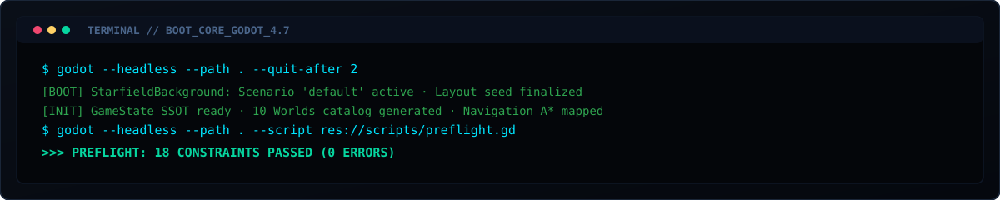

<br/>

*Frontbasis Ocean an alle eintretenden Operatoren: Bevor ihr euch in die Weltkarte stürzt, braucht ihr das Haupt-Terminal. Das hier ist die Anleitung. Sie ist kurz, weil Zeit knapp ist.*

### Voraussetzungen

- **Godot 4.7** Console-Binary (nicht Editor, nicht Steam-Version)
- `GODOT_BIN` auf die Binary zeigen lassen **oder** `godot` / `godot4` auf PATH

```bash
# Umgebungsvariable setzen (Pfad an euer System anpassen)
export GODOT_BIN=/pfad/zu/godot4_console

# Oder direkt auf PATH:
export PATH="$PATH:/pfad/zu/godot-binary-verzeichnis"
```

### Repository klonen & verifizieren

```bash
git clone <repo-url>
cd snip-war

# Smoke-Test: Bootet die Hauptszene, wartet 2 Sekunden, beendet sich
$GODOT_BIN --headless --path . --quit-after 2

# Vollständige Preflight-Suite (36 Constraints)
$GODOT_BIN --headless --path . --script res://scripts/preflight.gd
```

> [!NOTE]
> Der Headless-Lauf spuckt am Ende `ERROR: ...RID allocations...leaked` und `ObjectDB instances leaked`. Das ist Teardown-Rauschen des Dummy-Renderers, kein Fehler. Was zählt: die Zeile `RESULT: PASSED`.

Die Hauptszene ist `scenes/main_menu/main_menu.tscn` (Neues Spiel / Weiter / Beenden). Von dort bootet der `SceneDirectorService` die Strategie-Overworld (`scenes/world/world.tscn`), Layer-2-Flottenreplays (`scenes/battle/battle_scene.tscn`) und Layer-3-Eroberungsreplays (`scenes/conquest/conquest_scene.tscn`) — drei bootbare Szenen über einem gemeinsamen `GameState`-SSO.

---

## 🪐 DIE WELTEN DER EISEN-GRENZE — Aufgeklärter Kartenausschnitt & Sektorstatus

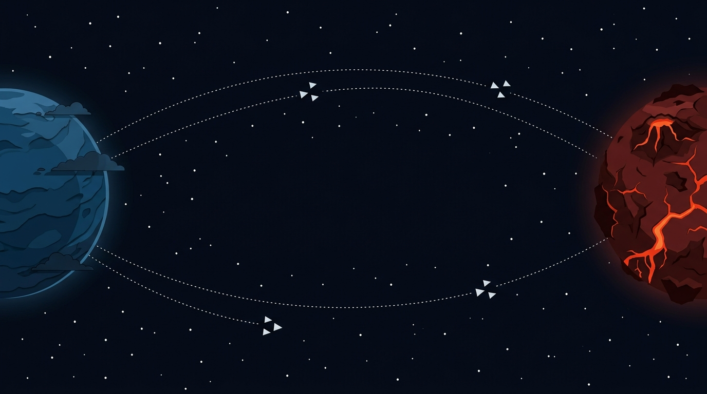

<br/>

```mermaid
graph LR
	subgraph A[" 🟦  Fraktion Alpha — Basis Ocean "]
		Ocean["🌊 OCEAN
        ──────────
        Homeworld · XL
        3 Bauplätze · 6 Worker
		Status: Hält tapfer die Stellung"]
	end

	subgraph N[" ⬜  Neutrales Niemandsland (illustrativer Startausschnitt) "]
		Ember["🔥 Ember"]
		Ice["❄️ Ice"]
		Violet["💜 Violet"]
		Desert["🏜️ Desert · L-Klasse"]
		Toxic["☣️ Toxic
		(Satellit + Asteroidengürtel)"]
		Storm["⚡ Storm · L-Klasse"]
		Volcanic["🌋 Volcanic"]
		Golden["✨ Golden"]
	end

	subgraph B[" 🟥  Fraktion Beta — Basis Paper "]
		Paper["📄 PAPER
        ──────────
        Homeworld · XL
        3 Bauplätze · 6 Worker
		Status: Plant aktiv Ärger"]
	end

	Ocean -.-&gt;|"Scouts · Worker · Hoffnung"| Ember
	Ocean -.-&gt; Ice
	Ember -.-&gt; Violet
	Ice -.-&gt; Desert
	Violet -.-&gt; Toxic
	Desert -.-&gt; Storm
	Toxic -.-&gt; Volcanic
	Storm -.-&gt; Golden
	Volcanic -.-&gt; Paper
	Golden -.-&gt; Paper

	style Ocean fill:#1c4a7a,color:#9ecfff,stroke:#478cbf,stroke-width:2px
	style Paper fill:#7a1c2e,color:#ffb3c1,stroke:#ef476f,stroke-width:2px
	style Toxic fill:#2d4a1c,color:#b3ff9e,stroke:#4caf50,stroke-width:2px
```

> [!NOTE]
> Die Grafik zeigt den anfänglichen aufgeklärten Ausschnitt, nicht die Grenze der Welt. Beide Shipped-Szenarien nutzen eine prozedurale Chunk-Welt (`chunk_size > 0`); weitere Planeten werden bei Erkundung und wachsendem FoV erzeugt.
>
> Routing läuft über **Moon- und Comet-Waypoints** (Layout-Nachbarschaft) plus einen prozentualen K-Nearest-Langstreckengraph (`NavigationField`). AStar2D wählt den kürzesten Pfad. `NavigationField` ist die einzige Quelle der Wahrheit — `get_neighbors_for_planet()` versorgt Preview, Worker-Transit, Scout und ShipBase.

<details>
<summary>📐 <b>Planetenprofile — Seed-deterministische Klassifizierungsdaten</b></summary>

| Klasse | Profil | Spawn-Intervall | Spawn-Menge | Basis-Garnison | Bauplätze | Ressourcenbasis |
|:---:|:---:|:---:|:---:|:---:|:---:|:---:|
| **XL** | `extra_large` | 5.0 s | 3 Einheiten | 6 Worker | 3 Slots | 3× |
| **L** | `large` | 7.0 s | 2 Einheiten | 4 Worker | 2 Slots | 2× |
| **Variable** | `variable` | 10.0 s | 1 Einheit | 2 Worker | 1 Slot | 1× |

Worker-Spawn-Timer existieren auf jedem Planeten, bleiben aber **inaktiv** bis `worker_automation` erforscht und eine Worker-Fabrik errichtet wurde. Kein Autostart.

Im Default-Sektor gibt es **eine** L-Klasse-Welt (`large_count = 1`). L-Klasse-Welten haben doppelten Ressourcenertrag und doppelte Attraktivität als Konfliktziel.

</details>

---

## ⚡ RESSOURCENLAGEBERICHT — Die fünf Säulen des Faction-Vaults


<br/>

<div align="center">

| | Rohstoff | Strategischer Nutzen |
|:---:|:---|:---|
| ⚡ | **Energy** | Werftbau, Scanner-Drohnen, Systembetrieb |
| 🌿 | **Biomass** | Worker-Automation & Kolonisation |
| 💠 | **Exotisch (`rare`)** | Planetares Vermessungswesen |
| 🧪 | **Volatil (`volatile`)** | Waffensysteme & spätere Mech-Doktrin |
| 🔩 | **Material** | Rümpfe, Extraktoren, Werften |

</div>

> [!IMPORTANT]
> **Ressourcen sind unsichtbare `GameResource`-Datenobjekte aus dem `ResourcePool`.**
> `Bootstrap` dealt sie nach dem finalen Layout-Seed seed-deterministisch über den aktiven Katalog.
> Homeworlds erhalten garantiert *unterschiedliche* Ressourcen; der Rest wird round-robin ausgeglichen (Häufigkeiten weichen um höchstens eins ab).
> Das Faction-Vault hat strikten **Overdraft-Schutz**: `spend_faction_resource()` blockiert unbezahlbare Vorhaben vollständig — keine Teilzahlungen, keine Schulden.

Die Reihenfolge des `resource_ids`-Shuffles ist Teil des Seed-Vertrags. Wer `deal_resources()` anfasst, bricht bestehende Reproduzierbarkeit.

---

## 🏗️ INFRASTRUKTUR-DOKTRIN — 17 Planeten-Upgrades in 4 Zweigen

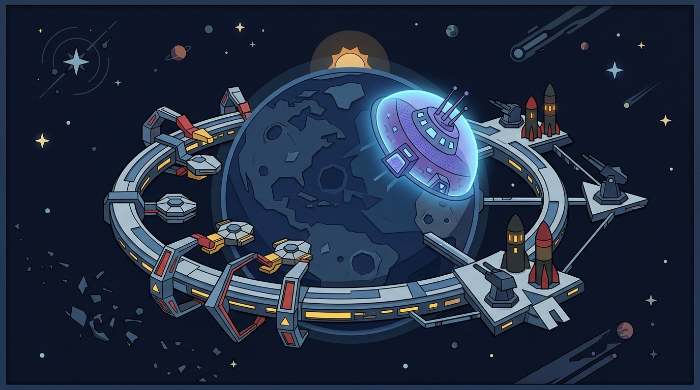

<br/>

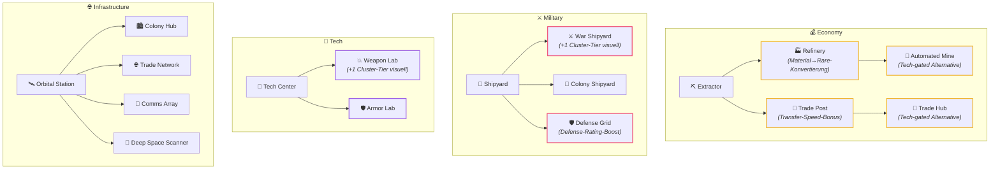

**Exklusivitätsregeln:** `refinery` ⮂ `trade_post` · `automated_mine` ⮂ `trade_hub` · `war_shipyard` ⮂ `colony_shipyard` · `weapon_lab` ⮂ `armor_lab`

> [!NOTE]
> `cluster_tier_bonus` ist rein visuell. Es verschiebt die sichtbare K/M/L-Clusterstufe nach oben, ändert aber nichts an logischer Kapazität, Packing-Logik, Fluglast oder Ankunftszählern.
> `refinery` konvertiert 2 Material + 1 Energy → 1 Rare (`convert_refinery_resources()`). Refund bei Energy-Knappheit. `automated_mine` und `trade_hub` sind Tech-gated Alternativen zu `refinery` bzw. `trade_post`.

---

## 🚀 SCHIFFSBAU & FORSCHUNG — Vom freien Start-Scout zur Flotte

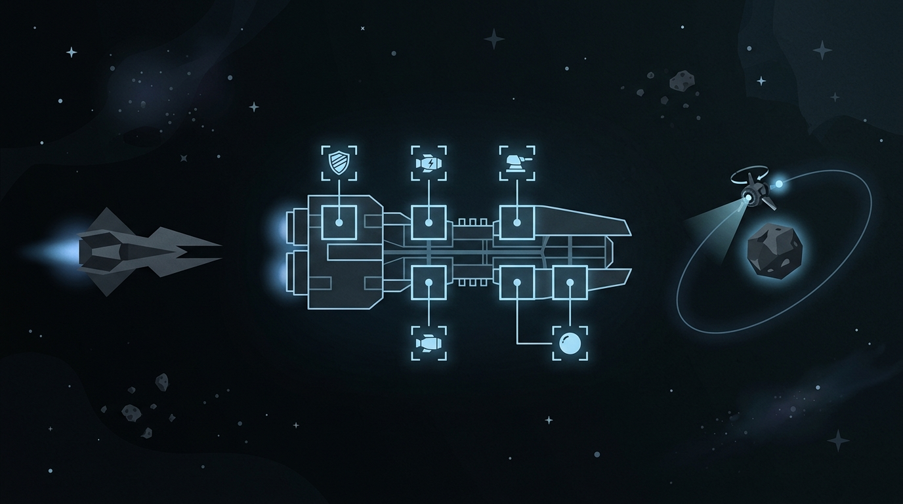

<br/>

> *„Wir haben einen modularen Schiffs-Hangar. Er montiert Rümpfe, Antriebe, Waffen, Schilde und Scanner. Montierte Assemblies fliegen heute als echte ShipBase-Transits durch die Overworld und lösen am Ziel einen FleetBattle-Simulator aus."*

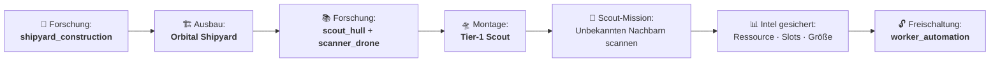

*Der neue Spieler bekommt exakt **einen kostenlosen Start-Scout**. Keine Werft nötig, kein Research. Danach gelten die vollen Gates.*

### Technologie-Katalog

| Kategorie | Tech-ID | Kosten | Effekt | Exklusiv zu |
|:---|:---|:---|:---|:---|
| 🚀 **Ships** | `shipyard_construction` | 10 Energy | Schaltet Werft-Upgrade frei | — |
| 🚀 **Ships** | `scout_hull` | 15 Material | Leichter T1-Aufklärungsrumpf | — |
| 🚀 **Ships** | `scanner_drone` | 10 Energy | Scout deckt Planeten auf und sichert Intel | — |
| 🚀 **Ships** | `weapon_systems` | 12 Volatile | Bordwaffen & T2-Mehrzweckrumpf freigeschaltet | — |
| 🚀 **Ships** | `worker_automation` | 15 Biomass | *(Discovery-Gate)* Erste Worker-Fabrik baubar | — |
| 🚀 **Ships** | `advanced_propulsion` | 20 Volatile | Verbesserter Antrieb | `heavy_armor_plating` |
| 🚀 **Ships** | `heavy_armor_plating` | 20 Material | Schwere Panzerung | `advanced_propulsion` |
| 🤖 **Mech** | `mech_frame` | 25 Volatile | T1-Chassis, sichtbar aber bis Layer 3 inert | — |
| 🔍 **Scan** | `deep_scan` | 15 Energy | Tiefenscan-Modus | `long_range_sensors` |
| 🔍 **Scan** | `long_range_sensors` | 15 Rare | Langstrecken-Sensorik | `deep_scan` |
| 🪐 **Planet** | `planetary_survey` | 10 Rare | Planetenproduktion auf 125 % | — |
| 🪐 **Planet** | `planetary_extraction` | 20 Material | Baut Survey aus: Produktion auf 150 % | — |
| 💰 **Economy** | `automated_refinery` | 25 Rare | Schaltet `automated_mine`-Upgrade frei | `bulk_processing` |
| 💰 **Economy** | `bulk_processing` | 25 Biomass | Schaltet `trade_hub`-Upgrade frei | `automated_refinery` |

**Forschung ist zeitgesteuert** — Kosten werden beim Start abgebucht. `technology_researched` / `ship_assembled` feuern erst bei Abschluss.

### Schiffsmontage

Vollständiger Loadout: `hull + drive + shield + scanner + optionale weapon + module_ids`

- **Unbewaffnet** → Kolonieschiff, besiedelt ausschließlich gescannte neutrale Planeten
- **Mit Waffe** → Militärschiff, löst am Ziel FleetBattle-/Conquest-Auflösung aus

---

## 🛤️ TRANSIT & LOGISTIK — Die Physik der Eisen-Grenze


<br/>

```
Flugzeit = (Distanz / 100) × 8.0 × (1.0 + 0.05 × √(max(Einheiten − 1, 0)))
           ÷ Transfer-Geschwindigkeitsmultiplikator der Quelle
```

Preview und tatsächlicher Transit verwenden dieselbe `FlightTime.seconds_for()`-Funktion. Wenn sie divergieren, ist der Speed-Multiplikator der Quelle nicht beidseitig übergeben.

**Cluster-Packing** (largest-first, alle Gruppen starten im selben Frame):

| Tier | Kapazität (logisch) | Formation |
|:---:|:---:|:---:|
| **K** | 1 | Solo |
| **M** | 5 | V-Formation |
| **L** | 100 | Keil |

7 Worker → `M + K + K`. Die Tier-Grenzen für Kapazität und Display sind absichtlich verschieden.

**Missionsarten:**

| Typ | Gate | Effekt |
|:---|:---|:---|
| `military` | — | Angriff / Eroberung; Konflikt möglich |
| `colony` | Gescanntes neutrales Ziel | Friedliche Besiedlung, setzt `first_colony`-Meilenstein |
| `cargo` | Eigener Zielplanet | Truppenverlegung ohne Eroberung |
| `collect` | Bekanntes neutrales Scan-Ziel | Persistente Gatherer, zahlen `workers × resource_base` pro Tick |

### Konsequenz-UI vor dem Dispatch

Das Planet-Panel ist in Lage, Auftrag und Bestätigung getrennt. Der Inhalt bleibt scrollbar, während der Action-Footer mit **MISSION STARTEN** sichtbar bleibt. Vor dem Start zeigt die Vorschau:

- `N / Maximum Einheiten` und die nach dem Abflug verbleibende Garnison;
- Ziel, Missionsabsicht und spielerische Kurzbeschreibung;
- gemeinsame Flugzeit aus derselben `FlightTime.seconds_for()`-Berechnung wie der Transit;
- erwartete Rückkehrladung bei `collect`, Verstärkung bei `cargo` sowie Konflikt-/Eroberungsrisiko bei `military`;
- lokale Vorräte und bekannte Scan-Intel, ohne technische Planet-IDs in der Oberfläche.

Die Karte tritt bei geöffnetem Panel dezent zurück. Gelb markiert die aktive Dispatchroute, das übrige Netz bleibt als Navigationsreferenz sichtbar. Unbekannte Ziele bleiben im Nebel und werden nicht durch eine Vorschau verraten.

---

## 🤖 KI-DISPATCH-DOKTRIN — Fraktion Beta schläft nicht

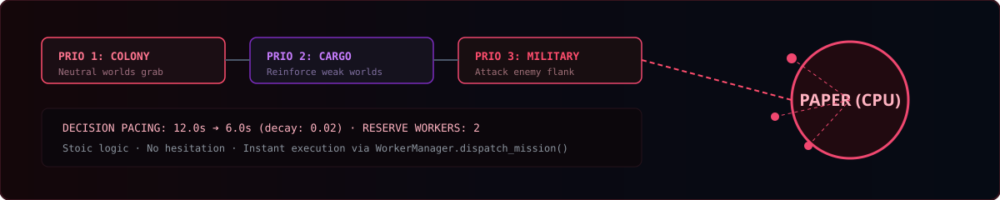

<br/>

Das Paper-Kollektiv (`CpuDispatchAI`) arbeitet mit adaptivem Pacing:

```
decision_interval:     12.0s  →  sinkt mit pacing_decay_rate: 0.02
min_decision_interval:  6.0s  (Untergrenze)
reserve_workers:            2  (eiserne Reserve, immer einbehalten)
minimum_source_workers:     3  (kein Dispatch unter diesem Wert)
dispatch_fraction:        0.5
```

**Entscheidungspriorität:**

```
1. Kolonisieren  →  nächster neutraler Planet via Colony-Mission
2. Verstärken    →  schwächerer eigener Planet via Cargo-Mission
3. Angreifen     →  unterlegener Spielerplanet via Military-Mission
```

Die KI simuliert keine Schiffs- oder Mech-Kämpfe. Sie ist ein Overworld-Dispatcher — präzise, ohne Sentimentalitäten, ohne Pause.

---

## ⚔️ KONFLIKT-RESOLVE — Die Arithmetik der Eisen-Grenze

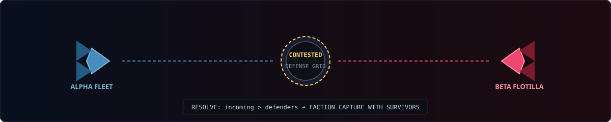

<br/>

Militärischer Arrive-Resolve in `PlanetArrivalResolver` — zwei Pfade:

**Worker-Military-Transits** (`resolve_military_arrival`) — Hauptpfad:
```
1. Gleiche Fraktion              →  alle eingehenden Worker verstärken den Zielplaneten (Fallback: resolve_arrival)
2. ConquestSimulator.simulate_conquest()  →  deterministische Simulation
3. conquest.captured == true     →  Faction-Wechsel; Überlebende als Worker registriert
4. conquest.captured == false    →  Angriff abgewehrt; bis zu incoming Worker entfernt
```

**Schiffs-Ankünfte** (`resolve_ship_arrival`) — Layer 2:
```
1. Colony-Schiff    →  friedliche Besiedlung (nur gescannte neutrale Ziele)
2. Defender-Fleet   →  FleetBattleSimulator (fleet-vs-fleet)
3. Keine Defender   →  ConquestSimulator (fleet-vs-ground)
```

Für montierte Schiffe: Layer 2 (`FleetBattleSimulator`). Für planetare Bodeneroberung: Layer 3 (`ConquestSimulator`) — funktional für Worker-Military-Transits, Mech-Tech-Stubs vorhanden.

---

## 🏛️ ARCHITEKTUR — Vom Katalog zum Spielstand

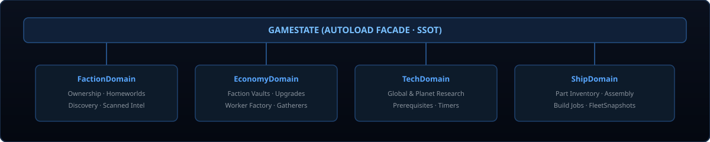

<br/>

```
MainMenu (scenes/main_menu/main_menu.tscn)
	├── Neues Spiel  →  GameState.request_new_run() + SceneDirector.goto_scene("world")
	└── Weiter       →  SaveGameService.load_run(0) + goto_scene("world")

WorldBootstrap._enter_tree()  (Wurzel von scenes/world/world.tscn)
    ├── Szenarioauswahl (ScenarioCatalog)
    ├── Layout-Seed finalisieren (_finalize_layout_seed)
    ├── WorldGenerator.generate_catalog()  →  aktiver Startkatalog (p0/p1 = Homeworlds)
    ├── ChunkCoordinator  →  weitere Planeten lazy aus Seed und FoV erzeugen
    └── GameState.begin_new_game()/reconnect_world()  →  SSOT für Ownership, Ressourcen, Forschung, Upgrades

Bootstrap._ready()
    └── deal_resources(catalog, pool, seed)  →  deterministischer Ressourcen-Deal

PlanetField._enter_tree()
    └── SeededLayout._enter_tree()  →  Planeten-Nodes erzeugen, Größenprofile, Detail-Seeds
        └── PlanetNetwork._ready()  →  Nachbarschaftsgraph, NavigationField, UI-Aufbau
```

Der `Background`-Renderer (`starfield_background.gd`) ist reine Optik; Szenario-, Seed- und Kataloglogik lebt ausschließlich im `WorldBootstrap`. Spielstände schreibt der `SaveGameService`-Autoload als `RunSaveData`-Resource nach `user://saves/` (atomar, versioniert); Layer-2/3-Replays wandern über `GameState.pending_battle_context` + `SceneDirectorService` nahtlos hin und zurück.

**`GameState`** ist Autoload und delegiert intern an vier Domain-Manager:

| Domain | Zuständigkeit |
|:---|:---|
| `FactionDomain` | Ownership, Homeworlds, Discovery, Scan-Intel, Starter-Scout |
| `EconomyDomain` | Vaults, Ressourcen-Deals, Upgrades, Worker-Factories, Gatherer |
| `TechDomain` | Globale & planetare Technologien, Research-Jobs, Prerequisites |
| `ShipDomain` | Teile-Inventar, Montage (`assemble_ship`), Bau-Jobs, FleetSnapshot |

Alle öffentlichen APIs und Signale bleiben als abwärtskompatible Delegaten erhalten. Captures laufen ausschließlich über `GameState.set_faction()`.

**UI-Stack:**

| Layer | Komponente | CanvasLayer |
|:---|:---|:---:|
| Planetennetz & Routing | `PlanetNetwork` | — |
| Dossier Launcher | `DossierLauncher` | 40 |
| HUD, VaultBar, PlanetPanel | `PlanetNetworkUI` | 50 |
| Technologie-Menü | `TechnologyMenu` | 60 |
| Pause-Menü | `PauseMenu` | 70 (PROCESS_MODE_ALWAYS) |
| Paper-Dossier (Vollbild) | `PaperDossier` | 80 |
| Capture Decision | `CaptureDecisionOverlay` | 90 |
| Paper-Grain & Vignette | GrainOverlay | 100 |

`TechnologyMenu` schließt das Planet-Panel bei Öffnung. ESC pausiert nicht, wenn Panel oder Tech-Menü offen sind. Das `PaperDossier` friert die Welt (Dim + Camera-Block) und zeigt ein rotiertes Papier-Blatt mit Scale/Fade-Tween; ESC schließt das Dossier statt zu pausieren.

---

## 📄 PAPER-DOSSIER — Vollbild-Menüs im Papier-Stil

Die drei Hauptansichten (Planeten-Management, Hangar/Werkstatt, Forschungsbaum) sind als fullscreen Modale implementiert, die sich organisch in den Papercraft-Comic-Stil einfügen.

**Öffnen:** Drei Launcher-Buttons oben links (`PLANET`, `WERKSTATT`, `FORSCHUNG`) auf CanvasLayer 40. Beim Öffnen werden die kompakten rechtsseitigen Panel geschlossen.

**Modal-Verhalten:**
- Welt wird abgedunkelt (semi-transparente Überlagerung)
- Kamera-Pan/Zoom/Selektion blockiert
- Leicht schräges Papier-Blatt (−1,1°) klappt mit Scale (0,95→1,0) und Fade-In ein
- ESC schließt das Dossier, nicht die Pause

**Die drei Ansichten:**

| Ansicht | Inhalt | Verwendete Logik |
|:---|:---|:---|
| **Planet-Dossier** | Papier-Planet mit rotierenden Orbital-Ringen, Magnet-Plättchen für Bauplätze | `PlanetUpgradeCatalog`, `GameState.purchase_upgrade` |
| **Werkstatt** | Millimeterpapier-Hintergrund, modulare Schiffs-Montage, Kaufen/Zerlegen/Starten | `TechShipBuilderView` (bestehende Logik) |
| **Forschungsbaum** | Verzweigter Stammbaum mit handgezeichneten Elbow-Connectoren, Klick zum Forschen | `TechnologyCatalog`, `GameState.research_technology` |

**Technische Umsetzung:**
- `PaperDossier` (CanvasLayer 80): wiederverwendbarer Modal-Shell mit Dim, Papier-Sheet, Scale/Fade-Tween
- `ModalCoordinator` (Node): Besitzt das Dossier, blockiert die Kamera, koordiniert ESC
- `MapCamera.set_input_blocked()`: sperrt Pan/Zoom/Selektion während ein Modal offen ist
- `PauseMenu._overlay_ui_open()`: defers ESC an Dossier-Schließen statt Pause

---

## 📊 LAGEZENTRUM — Frontbericht

```
LAYER 1 — STRATEGISCHE OVERWORLD
████████████████████████████████░░  ~95%  Wirtschaft, Transit, Forschung, Scouts, UI-HUD + Paper-Dossier-Modale

LAYER 2 — FLOTTENSIMULATION
████████████████████████████████░░  ~95%  FleetBattleSimulator + BattleScene-Replay und
                                          route-basierte Engagements im Live-Transit aktiv

LAYER 3 — PLANETARE EROBERUNG
████████████████████████░░░░░░░░░░  ~75%  ConquestSimulator + ConquestScene + Tower-Defense + Minion-Adapter
                                          Mech-Kampflogik bleibt als spätere Doktrin inert

CHUNK-WELT (prozedural, unendlich)
████████████████████░░░░░░░░░░░░░░  ~60%  ChunkCoordinator, FoV-Cycling, inkrementelle Navigation
```

> [!CAUTION]
> Nicht als implementiert behandeln: Eine sichtbare Planetensignatur ist aktuell kein fester Ressourcen-Contract; Mech-Kampflogik bleibt inert; komplexe Kampagnen-/Siegbedingungen sind noch offen. Die aktuelle UI, die Dispatch-Konsequenzen und die deterministischen Layer-2/3-Replays sind dagegen Laufzeitbestandteil.

---

## 🛠️ PRÜFSEQUENZ — Automatisierte Vertragsverifizierung

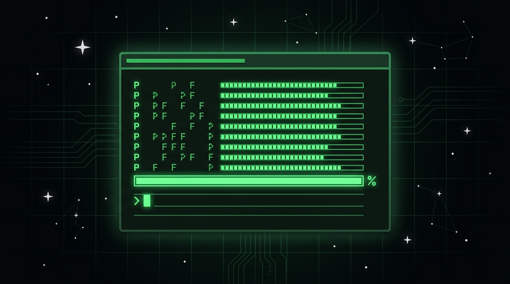

<br/>

Die Preflight-Suite (`scripts/preflight.gd`) ist der einzige autoritative Verifikationsweg. Kein Framework, kein externer Runner — läuft headless im selben Prozess wie das Spiel.

```bash
# Smoke-Test: Hauptszene bootet durch
$GODOT_BIN --headless --path . --quit-after 2

# Alle 38 Constraints (V2 Auto-Discovery)
$GODOT_BIN --headless --path . --script res://scripts/preflight.gd
```

<details>
<summary>📋 <b>Die 38 Preflight-Constraints (V2)</b></summary>

| # | Constraint | Prüft |
|:---:|:---|:---|
| 1 | `game_state_compatibility` | Reflection-Check aller GameState-Façade-Methoden & Signalverträge |
| 2 | `effects_and_traits` | Kampfeffekte, Modifikatoren & Trait-Mathematik |
| 3 | `flight_and_dispatch` | Flugzeitberechnung & Cluster-Packing |
| 4 | `world_generator_scaling` | Deterministische Welt- & Katalogexpansion |
| 5 | `navigation_growth` | Wachstumsfaktoren & KNN-Langstreckengraph |
| 6 | `scene_boot` | Szenen-Bootstrapping & Viewport-Synchronisation |
| 7 | `resources_and_seed` | Seed-Deterministik & Ressourcen-Deals |
| 8 | `world_planets_and_dispatch` | Planetennetz, Routen & Transitlinien |
| 9 | `world_details_and_scale` | Detail-Generierung & Orbit-Skalierungen |
| 10 | `upgrade_catalog` | Upgrade-Zweige, Voraussetzungen, Exklusivität & Trait-Verträge |
| 11 | `economy_production` | Upgrades, Produktions-Boosts, Maintenance & Raffinerie-Konvertierung |
| 12 | `mission_semantics` | Colony-/Cargo-/Military-Missions-Semantik |
| 13 | `cpu_dispatch` | CPU-Dispatch-AI, Worker-Kosten & Cluster-Tier-Boni |
| 14 | `selection_and_context` | SelectionService, Tooltips & Kontextmenüs |
| 15 | `scout_and_discovery` | Werftbau, Scout-Flug & Scan-Intel |
| 16 | `ship_catalog_and_assembly` | Teile-Katalog, Variantenpools, Montage & Tech-Gating |
| 17 | `ship_transit_and_arrival` | ShipBase-Transit, FleetPreview & Conquest-Replay |
| 18 | `colony_milestone` | Colony-Ship-Siedlung & first_colony-Meilenstein |
| 19 | `event_log` | Toasts, History & Logfile-Export |
| 20 | `camera_and_input` | Kamera-Pans, Zoom & Input-Mappings |
| 21 | `pause_and_context` | Modale UI-Hierarchie & Pausenstatus |
| 22 | `layers_2_and_3` | FleetBattleSimulator, ConquestSimulator, Replay-Daten |
| 23 | `ingame_player_and_transitions` | IngamePlayerControls, FloatingText & SceneDirector |
| 24 | `sector_classification` | Sektor-Klassifikation & Planeten-Typ-Zuordnung |
| 25 | `grid_system` | Grid-System & Chunk-Grid-Verifikation |
| 26 | `local_resources` | Lokale Ressourcen & Planeten-Resource-Signaturen |
| 27 | `conquest_grid_combat` | Grid-basierter Conquest-Kampf & Eroberungslogik |
| 28 | `paper_style` | Paper-/Papercraft-Comic-Visuallinie & Asset-Stil |
| 29 | `chunk_expansion` | Deterministischer Chunk-Seed, inkrementelle Navigation & Prozedural-Deal |
| 30 | `main_menu_and_flow` | Hauptmenü, SceneDirector-Registry & Continue-Gating |
| 31 | `context_handover` | World→Battle→World-Szenenwechsel über den SceneDirector |
| 32 | `save_game_roundtrip` | Verlustfreier Save/Load-Roundtrip eines mutierten Runs |
|| 33 | `save_game_slots` | Save-Slot-Write/Read/Overwrite/Corruption/Delete |
|| 34 | `mechanic_coverage` | Mechanic-Entdeckung, Test-Modell-Integrität & Szenario-Validierung |
|| 35 | `concept_index` | Konzept-Index-Abdeckung, Klassen-Mapping & Fuzzy-Search |
| 36 | `dead_code` | Heuristische Dead-Code-Analyse (Warnung, non-blocking) |
| 37 | `global_search` | Globaler Volltext-Search tool-funktional validiert |

</details>

Preflight ist modular (V2 Architecture). `scripts/preflight.gd` ist der Orchestrator mit Auto-Discovery. Die Constraints liegen einzeln unter `scripts/preflight/constraint_*.gd`. Neue Coverage kommt als eigene `PreflightConstraintX`-Klasse mit `constraint_name()` + `requires_scene()` + `run(ctx) -> bool` — wird automatisch vom Scanner entdeckt. Pure/Scene-Klassifikation wird aus `requires_scene()` jedes Constraints abgeleitet (Single Source of Truth).

---

## 🔧 ENTWICKLER-WORKFLOW — Commit-Kette

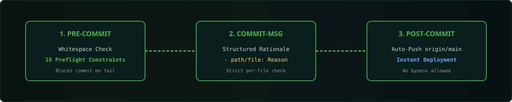

<br/>

Jeder `git commit` läuft durch die vollständige Hook-Kette und landet **sofort auf `origin/main`**. Es gibt keinen Skip-Pfad.

```
┌─────────────┐     ┌─────────────┐     ┌──────────────┐
│ pre-commit  │────▶│ commit-msg  │────▶│ post-commit  │
│             │     │             │     │              │
│ whitespace  │     │ Begründung  │     │ push origin  │
│ + preflight │     │ pro Datei   │     │ HEAD:main    │
└─────────────┘     └─────────────┘     └──────────────┘
		│                   │                    │
		▼                   ▼                    ▼
   Preflight-Fehler    Fehlende Begründung   Commit ist
   bricht den Push     bricht den Commit    sofort public
```

```bash
git add scripts/meine_datei.gd resources/meine_resource.tres
# Niemals: git add -A

git commit
# Jede gestagte Datei braucht eine Begründungszeile:
# - scripts/meine_datei.gd: Was wurde geändert und warum.
```

> [!WARNING]
> `core.hooksPath=/dev/null` ist deaktiviert. Es gibt keinen Bypass. Das ist Absicht.

**Bei Preflight-Fehlern:** Fehler lesen → Dateien korrigieren → `git add` + `git commit` → Hook-Kette wiederholt sich automatisch.

---

## 🗺️ STRATEGISCHE ROADMAP

> **[📊 Visuelle Entwicklungs-Roadmap öffnen](ROADMAP_VISUAL.html)** — Interaktive HTML-Übersicht mit Snapshot-Wachstums-Chart, Zeitstrahl, Fortschrittsbalken und Phasen-Zusammenfassung. Basierend auf 14 Snapshots (Aug 19–21) und dem aktuellen Code-Stand.

**Aktueller Stand (Aug 2026):**

| Metrik | Wert |
|:---|:---|
| GDScript-Dateien | **155** |
| Code-Zeilen | **22.469** |
| Szenen | **16** |
| Assets | **419** |
| Ressourcen | **91** |
| Preflight-Constraints | **33 PASS** |
| Snapshots | **14** (Aug 19–21) |

```mermaid
timeline
	title SnipWar Entwicklungsvektoren
	section ✅ Phase 1: Kernsysteme
		Layer 1 Overworld : Wirtschaft · Upgrades · Forschung · Scouts · CPU AI
		Simulatoren : FleetBattleSimulator · ConquestSimulator · IngamePlayer · SceneDirector
		Chunk-Welt : Prozedurale Expansion · FoV-Cycling · Inkrementelle Navigation
	section 🔮 Phase 2: Kampf-Integration
		Overworld-Trigger : Flottenbegegnungen lösen direkte Replays aus
		Ship-Traits im Gefecht : Modul- & Waffensets bestimmen Gefechtsdynamik
	section 🔮 Phase 3: Eroberung & Mechs
		Bodenkampf : Minion-Adapter für Schiffe · Abwehrtürme · Mech-Bataillone
	section 🔮 Phase 4: High-End Polish
		4K Asset Pipeline : VFX · dynamische Shader · atmosphärische Soundkulisse
```

---

<div align="center">

```
░░░░░░░░░░░░░░░░░░░░░░░░░░░░░░░░░░░░░░░░░░░░░░░░░░░░░░░░░░░░░░░░░░░░
  S · N · I · P · W · A · R
  Strategische Nebel-Imperien · Integrierte Planeten · Worker · Allianz-Routen
  (Akronym-Echtheit zu 100% zertifiziert vom galaktischen Standardbüro)
░░░░░░░░░░░░░░░░░░░░░░░░░░░░░░░░░░░░░░░░░░░░░░░░░░░░░░░░░░░░░░░░░░░░
```

**`CONNECT · DEPLOY · HOLD THE LINE`**

*Unendlich Welten. Ein deterministischer Seed. Keine Ausreden.*

---

| | |
|:---:|:---|
| 📖 **Galaktisches Archiv** | [`LORE.md`](LORE.md) — Feldberichte & Planetendossiers |
| 📐 **Technischer Vertrag** | [`DESIGN.md`](DESIGN.md) — Verbindliche Spezifikation |
| 🎯 **Zielvision** | [`VISION.md`](VISION.md) — 4X-Kreislauf & Roadmap |
| 🗺️ **Dokumentations-Index** | [`docs/README.md`](docs/README.md) — Struktur & Zugehörigkeiten |

---

<sub>SnipWar // Entwickelt mit Godot 4.7 & Vektorgrafiken · Stand: 2026</sub>

</div>
