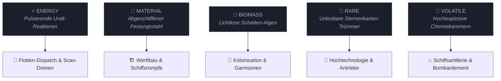

<div align="center">


<br/>

<table>
<tr>
<td align="center" width="100%">
<br/>
<samp>
<b>SNIPWAR — DIE EISEN-GRENZE</b><br/>
ANALOGES 4X-WELTRAUMEPOS · HANDGEZEICHNETE KOSMOLOGIE · PAPIER, STAHL & DER LAUTLOSE VOID
</samp>
<br/><br/>
</td>
</tr>
</table>

[](https://godotengine.org/)
[](#-das-spiel--vision--features)
[](ARCHITECTURE.md)
[](#)

</div>

---

<div align="center">

```
╔══════════════════════════════════════════════════════════════════════════╗
║  EINGEHENDE TRANSMISSION // FREQUENZ 142.8 MHz (WOW/FLUTTER: AKTIV)     ║
║  HERKUNFT: Sektor 07-Eisen-Grenze · Außenposten [GESCHWÄRZT]             ║
║  AKTENZEICHEN: EG-77-SNIP // VERTEILER: Einsatzleitung & Kolonisten      ║
║  STATUS: Dekodiert aus knisterndem Bandrauschen (-14.2 LUFS)             ║
╚══════════════════════════════════════════════════════════════════════════╝
```

*„Die Galaxie hat nicht gebrannt, als das Zentrum kollabierte.<br/>
Sie hat einfach aufgehört, Briefe zu schreiben. Der Rest ist Tinte, Panzerstahl und die Stille zwischen den Sternen.“*

</div>

---

## 📜 AKTE 001 // DAS SETTING: DIE EISEN-GRENZE

> **AUSZUG AUS DEM VERWALTUNGSBERICHT (LETZTE BEKANNTE SEITE, HANDSCHRIFTLICH AM RAND):**<br/>
> *„Der Rand der Galaxie ist keine Demarkationslinie. Er ist der Ort, an dem die Karten aufhören zu stimmen. Das Zentrum versuchte zweimal, ihn zu kartieren. Beide Sondengeschwader kehrten nicht zurück. Beim dritten Versuch entschied man, der Rand könne sich selbst verwalten. Das war der erste Fehler.“*

Willkommen an der **Eisen-Grenze**.

Hier draußen gibt es keine strahlenden Sternenkreuzer aus weißem Verbundstoff und keine heroischen Fanfaren. Das Universum am Rand besteht aus **knisterndem Millimeterpapier, verblichener Tusche, dem metallischen Klacken mechanischer Relais** und einer Logistik, die keinen einzigen Rechenfehler verzeiht.

Dichte Weltencluster liegen nah genug beieinander, um sich im Teleskop zu sehen – und weit genug, um sich abgrundtief zu misstrauen. Dazwischen liegt der **Void**: Dutzende Lichtjahre absoluter, eisiger Stille ohne jeden Navigationsanker. Wer hier durchreist, fliegt nicht auf Sicht. Er navigiert nach gestempelten Dossiers, kalkulierten Flugzeiten und dem festen Glauben, dass der Tank bis zum nächsten Waypoint reicht.

---

## 🏴‍☠️ DIE FRAKTIONEN IM NEBEL

<div align="center">

```
        ┌───────────────────────────┐         ┌───────────────────────────┐
        │    FRAKTION ALPHA         │         │    FRAKTION BETA          │
        │    (Basis «Ocean»)        │   VS.   │    (Basis «Paper»)        │
        │  Pragmatismus, Improvisation  │         │  Kalter Algorithmus, Logik │
        │    & akuter Stahlmangel   │         │    & endlose Automaten    │
        └─────────────┬─────────────┘         └─────────────┬─────────────┘
                      └───────────────┐     ┌───────────────┘
                                      ▼     ▼
                        ┌─────────────────────────────┐
                        │     DER NEUTRALE CLUSTER    │
                        │ Welten im Nebel des Krieges:│
                        │ Ember · Ice · Violet · Toxic│
                        └─────────────────────────────┘
```

</div>

### 🔵 Fraktion Alpha — Die Kolonisten von Basis *Ocean* (Du)
Gegründet in den wasserreichen Tiefland-Kuppeln von *Ocean*. Deine Truppen sind Strichmännchen-Pioniere: gezeichnet mit schwarzer Tinte, widerstandsfähig gegen die Trostlosigkeit des Voids und angetrieben von der Sturheit jener, die nirgendwo sonst hin können. Du startest mit einem einzigen Scout-Schiff, leeren Vorratskammern und einer Sternenkarte, deren Ränder noch im tiefen Nebel liegen.

### 🔴 Fraktion Beta — Das Kollektiv von Basis *Paper* (Die KI)
Auf der anderen Seite des Sektors summen uralte Industrie-Automaten. Niemand weiß, wer die Fabriken auf *Paper* vor Jahrhunderten in Betrieb nahm – aber sie haben nie aufgehört zu produzieren. Die gegnerische KI schläft nicht, kennt keine Panik und berechnet ihre Invasionskeile mit stoischer, mathematischer Kälte. Lässt du einen Planeten unbewacht, schlägt ihr Stempel zu.

### ⚪ Die Verlorenen Welten — Niemandsland im Transitkorridor
Planeten wie das glühend tektonische *Ember*, das gefrorene *Ice*, das giftige *Toxic* oder das geheimnisvolle *Violet*. Sie beherbergen verfallene Relikte, verlassene Förderstationen und Ressourcenbunker, die nur darauf warten, beansprucht oder im Orbit bombardiert zu werden.

---

## 💎 DIE FÜNF RELIKTE DES KOLLAPSES

Wir nennen sie nicht Rohstoffe. Das Wort würde implizieren, dass sie natürlich gewachsen sind. An der Eisen-Grenze sind Ressourcen die **Trümmer einer vergangenen Zivilisation**:



| Symbol | Relikt | Herkunft & Wahre Natur | Strategischer Verwendungszweck |
|:---:|:---|:---|:---|
| ⚡ | **Energy** | Die letzten Pulse einer planetaren Maschinerie, deren Hauptschalter niemand je gefunden hat. | Treibstoff für Sensoren, Sprungtore & Deflektorschilde |
| 🔩 | **Material** | Panzerplatten von Grenzwällen, die einmal etwas Unbekanntes aufhalten sollten. Eingeschmolzen und neu vernietet. | Rumpfbau aller Schiffsklassen, Bunker & Orbit-Werften |
| 🌿 | **Biomass** | Wächst in den feuchten Schatten metallischer Ruinen – ohne Licht, ohne fruchtbaren Boden. | Lebenserhaltung für Worker-Cluster & Kolonie-Wachstum |
| 💠 | **Rare** | Seltsam pulsierende Kristallsplitter. Was sie einst waren, steht in keiner erhaltenen Akte. | T2-Schiffskomponenten, Langstrecken-Radare & Hyperantriebe |
| 🧪 | **Volatile** | Das einzige Relikt, das sich berechenbar verhält: Es brennt heiß und explodiert verlässlich. | Munition für Schlachtschiffe, Abfangraketen & Bombardement |

> [!CAUTION]
> **Das Gesetz des leeren Tresors:** In SnipWar gibt es keine Kredite und keine Schulden. Fehlt deinem Planeten auch nur eine Einheit Material, bleibt die Werft kalt. Wer den Nachschub nicht plant, stirbt im Orbit.

---

## 🌌 DIE 3 SPRACHEN DES KRIEGES (Die Layer-Hierarchie)

SnipWar verbindet makrostrategische Reichsverwaltung nahtlos mit taktischen Duellen:


### 🪐 Layer 1: Die Strategische Sternenkarte (Overworld)
*„Ein Blick von oben auf das Schachbrett des Voids.“*
* Erkunde prozedural generierte Sektoren-Chunks, die im dichten Fog of War schlummern.
* Schicke Worker-Schwärme über feingliedrige Waypoint-Netze, um Ressourcen zwischen Minen, Fabriken und Heimatwelten zu transportieren.
* Plane Handels-, Versorgungs- und Verteidigungskorridore über Dutzende von Systemen hinweg.

---


### ⚔️ Layer 2: Taktischer Flottenkampf (Fleet Battle Simulator)
*„Wenn zwei Formationen im Transit aufeinandertreffen, entscheidet kein Würfelwurf, sondern Konstruktion.“*
* **Modularer Schiffsbau auf Millimeterpapier:** Rümpfe, kinetische Geschütze, Antriebe, Reaktoren und Schildgeneratoren werden frei zusammengesetzt.
* **Formations-Physik:** Kleine Aufklärer fliegen solo; schwere Zerstörerverbände formieren sich zu massiven Keilen.
* Simulation von Reichweiten, Schildabsorption, Hüllenintegrität und gezieltem Rückzug.

---

### 🛡️ Layer 3: Planetare Eroberung & Bodenschlacht
*„Der Orbit gehört dir? Gut. Jetzt musst du den Boden halten.“*
* Lande mit Transportschiffen auf den rotierenden Orbit-Ringen umkämpfter Planeten.
* Belagere feindliche Verteidigungsbunker, knacke Schildgeneratoren und erobere Schritt für Schritt die Industrieanlagen der Oberfläche.

---

## 📂 DAS PAPER-DOSSIER // ANALOGES INTERFACE IM VAKUUM


Keine seelenlosen Sci-Fi-Tabellen. Dein Führungsstand ist ein **haptischer Schreibtisch am Rand des Universums**:

* 📑 **Das Planeten-Dossier:** Wie eine historische Akte aufgeschlagen. Magnetische Upgrade-Plättchen werden auf rotierende Orbitalringe geheftet, um Fabriken, Labore und Abwehrgeschütze zu installieren.
* 📐 **Der Blaupausen-Hangar:** Zeichne Raumschiffe direkt auf technischem Rasterpapier. Jedes Bauteil knistert, rastet ein und verändert das Massen- und Energieprofil deiner Flotte.
* 📜 **Der Pergament-Forschungsbaum:** Handgezeichnete Tech-Pfade, verbunden mit Tuschelinien. Schalte Doktrinen frei – von magnetischer Plasmabeschleunigung bis hin zu automatisierten Schrott-Recyclern.
* 📻 **Akustische Immersion:** Vom satten Stempel-Aufschlag über knisternde Bandaufnahmen bis hin zu den sanften Reibegeräuschen echten Papiers – die eigens entwickelte Sound-Synthese erweckt die analoge Haptik zum Leben.

---

## 🚀 SCHNELLSTART // KOMMANDO-ÜBERNAHME


### Für Flottenkommandanten (Spielstart im Godot Editor)
1. Klone das Repository und öffne es in **Godot 4.7** (Standard-Build).
2. Drücke **F5** (oder lade die Hauptszene `res://scenes/main_menu/main_menu.tscn`).
3. Wähle **"Neues Spiel"**, lausche dem Intro-Funkspruch und entsende deinen ersten Scout in den Nebel!

### Für Tech-Offiziere & Automatisierungs-Agenten (Headless CLI)
```bash
# Godot 4.7 Binary definieren
export GODOT_BIN="C:/pfad/zu/Godot_v4.7.2-stable_win64_console.exe"

# Spiel direkt im Fenstermodus starten:
$GODOT_BIN --path . scenes/main_menu/main_menu.tscn

# Vollständige Preflight-Prüfsuite (40 mathematische & funktionale Contracts):
$GODOT_BIN --headless --path . --script res://scripts/preflight.gd -x

# Die semantische Konzept-Suche nach Spielsystemen befragen:
$GODOT_BIN --headless --path . --script res://scripts/concept_search.gd fleet
```

---

## 🎭 DIE VIERTE WAND // DER MASCHINENRAUM

Hinter der Fassade des Spiels arbeitet eine außergewöhnliche Entwicklungs- und Testmaschinerie:

### 📜 DOKI — Das erzählende Commit-Tor
In diesem Projekt gibt es keine leeren Commit-Nachrichten. Das **DOKI-System** fängt jeden Entwicklungsschritt ab. Ein deterministischer Hash-Generator wählt aus **14 Charakter-Persönlichkeiten** (vom zynischen Architekten *Devin* über den Forensiker *Squizzle* bis zum philosophischen Nihilisten *Null*) und **10 Stimmungs-Overlays**. Jeder Commit wird als fortlaufendes Kapitel einer galaktischen Chronik dokumentiert.

### 👁️ S.C.O.U.T. & Die Audio-Vision-Schicht
Während keine Tastatur berührt wird, übernehmen autonome KI-Agenten das Steuer. Über das integrierte MCP-System (**S.C.O.U.T.**) steuern sie Raumflotten, untersuchen das Spielgeschehen mittels **Tesseract-OCR**, analysieren Benutzeroberflächen pixelgenau und bewerten die Soundlandschaft über **Goertzel-Spektrogramme und K-Weighted LUFS-Meter**.

### 🛡️ 40 Unbestechliche Wächter (Preflight V2)
Jede Zeile Code muss 40 strenge Architektur-Verträge passieren: Determinismus-Seeds (`424242`), Speicherstand-Roundtrips, mathematische Flugzeit-Integrität und strikte Isolationstests sichern das Fundament.

---

## 🗺️ DAS GALAKTISCHE ARCHIV (DOKUMENTATION)

| Akte | Pfad | Inhalt & Zweck |
|:---|:---|:---|
| 🏛️ **Systemarchitektur** | [`ARCHITECTURE.md`](ARCHITECTURE.md) | Verbindlicher Vertrag: Domain-Manager, Formeln, Search-Tools, Preflight & Hooks. |
| 📖 **Feldberichte & Lore** | [`LORE.md`](LORE.md) | Die unzensierten Fragmente, Planeten-Dossiers und Zeugenaussagen. |
| 🎯 **Entwicklungs-Vision** | [`VISION.md`](VISION.md) | Der langfristige 4X-Masterplan und die Roadmap. |
| 🔍 **Befund-Register** | [`docs/FINDINGS.md`](docs/FINDINGS.md) | Zentrale Todo- & QA-Referenz: Verifizierte Fixes, OCR-Logs und offene Punkte. |
| 🤖 **MCP-Agenten-Doktrin** | [`addons/mcp/AGENTS.md`](addons/mcp/AGENTS.md) | Handbuch für autonome Agenten, Remote-Testing und Vision-Pipelines. |

---

<div align="center">

```
░░░░░░░░░░░░░░░░░░░░░░░░░░░░░░░░░░░░░░░░░░░░░░░░░░░░░░░░░░░░░░░░░░░░░░░░░░░░░░
  S · N · I · P · W · A · R   //   D I E   E I S E N - G R E N Z E
  Unendliche Welten · Ein deterministischer Seed · Keine Gnade im Void
░░░░░░░░░░░░░░░░░░░░░░░░░░░░░░░░░░░░░░░░░░░░░░░░░░░░░░░░░░░░░░░░░░░░░░░░░░░░░░
```

**`CUT OR DIE · HALTE DIE ROUTE · SICHERE DEN CLUSTER`**

<sub>SnipWar // Entwickelt mit Godot 4.7, GDScript & viel Zeichenpapier · 2026</sub>

</div>
