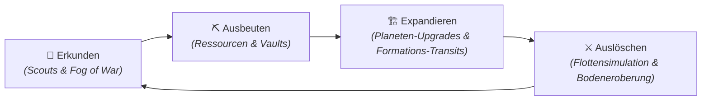

<div align="center">


<br/>

<table>
<tr>
<td align="center" width="100%">
<br/>
<samp>
<b>SNIPWAR — RAND DER GALAXIE</b><br/>
STRATEGISCHE OVERWORLD · UNENDLICHE WELTEN · PAPERCRAFT 4X · ZERO ORBIT SAFETIES
</samp>
<br/><br/>
</td>
</tr>
</table>

[](https://godotengine.org/)
[](#-das-spiel--vision--features)
[](ARCHITECTURE.md)
[](#)

</div>

---

<div align="center">

```
▓▓▓▓▓▓▓▓▓▓▓▓▓▓▓▓▓▓▓▓▓▓▓▓▓▓▓▓▓▓▓▓▓▓▓▓▓▓▓▓▓▓▓▓▓▓▓▓▓▓▓▓▓▓▓▓▓▓▓▓
▓                                                          ▓
▓   EINGEHENDE TRANSMISSION // KANAL 7-DELTA               ▓
▓   HERKUNFT: RAND DER GALAXIE · SEKTOR [GESCHWÄRZT]       ▓
▓   VERSCHLÜSSELUNG: KEINE (Zu teuer. Wurde abgelehnt.)   ▓
▓   EMPFÄNGER: Spieler, KI-Agenten & übermüdete Devs      ▓
▓                                                          ▓
▓▓▓▓▓▓▓▓▓▓▓▓▓▓▓▓▓▓▓▓▓▓▓▓▓▓▓▓▓▓▓▓▓▓▓▓▓▓▓▓▓▓▓▓▓▓▓▓▓▓▓▓▓▓▓▓▓▓▓▓
```

*„Die Galaxie ist unendlich. Zwei Fraktionen bilden sich ein, wichtig zu sein.<br/>
Der Rest besteht aus Papier, Koffein und deterministischen Zufallszahlen.“*

</div>

---

## 📡 TRANSMISSION-LOG // EINTRAG 001 (Die Vierte Wand)

> **AN:** Oberkommando, den Spieler an der Maus & die KI-Agenten im Hintergrund<br/>
> **VON:** Einsatzleitung, Frontier-Basis *Ocean*<br/>
> **BETREFF:** Lagebericht am Rand der Galaxie. Bitte lesen, schmunzeln, Sektor erobern.

Willkommen am **Rand der Galaxie**.

Wenn du dachtest, Raumfahrt sei voller glänzender Chromschiffe und epischer Orchestermusik, müssen wir dich enttäuschen: Hier am Rand besteht das Universum aus handgezeichneten Planeten, knisterndem Millimeterpapier und einem Logistiknetz, das dir keinen einzigen Fehler verzeiht.

Die strategische Lage ist denkbar simpel:
- **Fraktion Alpha (Du):** Operiert von Basis *Ocean*. Besitzt Hoffnung, einen kostenlosen Aufklärungs-Scout und akuten Ressourcenmangel.
- **Fraktion Beta (Die KI):** Operiert von Basis *Paper*. Rechnet pausenlos im Hintergrund, schläft nie und wartet nur darauf, dass du deine Garnisonen unbewacht lässt.
- **Das Niemandsland:** Unendlich viele prozedurale Planeten, die den fatalen Fehler begangen haben, genau im Transitkorridor zu liegen.

---

## 🎯 DIE VISION — 4X Strategie im Papercraft-Comic-Gewand

SnipWar kombiniert die Tiefe klassischer Weltraum-Strategie mit dem unverwechselbaren Charme eines analogen Brettspiels auf Millimeterpapier:



### Die 3 Spiel-Ebenen (Nahtlose Layer-Hierarchie)
1. **Layer 1 — Strategische Overworld:** Meistere die prozedural expandierende Sternenkarte. Schicke Worker-Cluster über Waypoint-Netze, baue Abbau-Stationen und plane Forschungsrouten.
2. **Layer 2 — Taktische Flottenkämpfe:** Montiere im Hangar Schiffe aus Rümpfen, Antrieben, Schilden und Waffen. Treffen Flotten im Transit aufeinander, entscheidet der **FleetBattleSimulator** über den Ausgang.
3. **Layer 3 — Planetare Bodeneroberung:** Schicke Truppen oder Mechs auf die Planetenoberfläche. Verteidigungstürme und Boden-Garnisonen kämpfen um die Vorherrschaft.

---

## 🎮 GAMEPLAY & SYSTEM-FUNKTIONEN


<br/>

### 1. 🪐 Prozedurale Chunk-Welten & Erkundung
Das Universum generiert sich dynamisch um deine Aufklärung herum. Neutrale Welten wie *Ember*, *Ice*, *Violet* oder *Toxic* liegen im Nebel des Krieges.
Erst wenn dein kostenloser **Start-Scout** mit Scannern ein System erreicht, werden Bauplätze, Rohstoffvorkommen und Planetenklassen enthüllt.

### 2. ⚡ Das Fünf-Ressourcen-System
Deine Fraktion verwaltet fünf essenzielle Güter in ihren Tresoren:

| Symbol | Ressource | Strategische Funktion |
|:---:|:---|:---|
| ⚡ | **Energy** | Treibstoff für Scanned-Dronen, Werftbetrieb & Abwehrschilde |
| 🌿 | **Biomass** | Kolonisation & Fabrik-Automation |
| 💠 | **Exotisch (`rare`)** | Vermessungs-Technologie & fortgeschrittener Schiffs-Hangar |
| 🧪 | **Volatil (`volatile`)** | Hochexplosiver Munitionsvorrat & Waffen-Doktrinen |
| 🔩 | **Material** | Schiffsrümpfe, Planeten-Extrakte & Schutzbunker |

> [!IMPORTANT]
> **Strikter Overdraft-Schutz:** In SnipWar gibt es keine Schulden. Wer keine 20 Material im Tresor hat, baut kein Schiff. Punkt.

---

### 3. 📄 Das Paper-Dossier — Vollbild-Papier-Interface


<br/>

Vergiss kalte Tabellen-Menüs! In SnipWar klappt auf Knopfdruck das **Paper-Dossier** auf — ein handgezeichnetes Papier-Blatt im Dreh- & Scalemodus:

- **Planeten-Dossier:** Setze Magnet-Plättchen auf rotierende Orbit-Ringe, um Extraktoren, Raffinerien oder Werften zu errichten.
- **Der Hangar:** Kombiniere Rümpfe (T1 Scout bis T2 Schlachtkreuzer), Antriebe und Bordwaffen auf Millimeterpapier.
- **Der Forschungsbaum:** Verzweigte Tech-Pfade mit handgezeichneten Verbindungsstrecken schalten neue Doktrinen frei.

---

### 4. 🚀 Schiffsbau & Logistik-Transits


<br/>

Einheiten fliegen nicht einfach von A nach B — sie formieren sich in Abhängigkeit ihrer Gruppenstärke auf den echten Waypoint-Routen der Galaxie:

```
Solo (Tier K)      ──▶  1 Worker / Scout
V-Formation (Tier M) ──▶  5 Einheiten
Keil-Formation (Tier L) ──▶  100 Einheiten (Invasionsflotte)
```

Mit dem **Dispatch-UI** siehst du schon vor dem Abflug exakte Ankunftszeiten, verbleibende Garnisonen und das geschätzte Eroberungsrisiko.

---

## 🕹️ QUICKSTART — WIE SPIELE ICH SNIPWAR?


<br/>

### Option A: Im Godot Editor (Empfohlen für Spieler & Creator)
1. Öffne das Projekt in **Godot 4.7**.
2. Drücke **F5** (oder starte die Szene `scenes/main_menu/main_menu.tscn`).
3. Wähle **"Neues Spiel"** und erobere deinen ersten Sektor!

### Option B: Über die Konsole (Headless & Developer)
```bash
# Setze deine Godot 4.7 Binary
export GODOT_BIN="/pfad/zu/Godot_v4.7.2-stable_win64_console.exe"

# Starte das Spiel direkt im Fenstermodus:
$GODOT_BIN --path . scenes/main_menu/main_menu.tscn

# Oder führe die automatische Preflight-Prüfsuite aus:
$GODOT_BIN --headless --path . --script res://scripts/preflight.gd -x
```

---

## 🤖 DIE VIERTE WAND — BEHIND THE SCENES & DEV-ANOMALIEN

*Ein kurzer Blick hinter die Kulissen der Entwicklung:*

### 📜 DOKI — Der Git-Commit-Narrator
In diesem Repository gibt es kein trockenes `git commit -m "fix bug"`. Der **DOKI CommitLayer** fängt jeden Commit ab und zwingt den Entwickler (oder die KI), die Änderungen aus der Sicht von einer von **14 Charakter-Personas** (z. B. *Buffy*, *Basher*, *Squizzle* oder *Vannon*) mit **10 Stimmungs-Overlays** zu erzählen. Welcher Narrator spricht, bestimmt ein deterministischer Hash-Key.

### 📡 S.C.O.U.T. — Wie KI-Agenten das Spiel im Dunkeln testen
Während du schläfst, testen KI-Agenten dieses Spiel über ein internes MCP-Addon (**S.C.O.U.T.**). Sie steuern Szenen, schicken Raumschiffe los und analysieren das Spielgeschehen über Tesseract-OCR und Screenshot-Analysen.

### 🧪 Preflight — 38 Hüter des Codes
Bevor ein einziger Commit in den Hauptzweig gelangt, prüft die maßgeschneiderte **Preflight-Suite** (38 automatische Contracts) alles: von der mathematischen Flugzeitformel über die Determinismus-Seeds bis hin zu Savegame-Roundtrips.

---

## 🔗 DOKUMENTATIONS-NAVIGATOR

Suchst du nach den harten technischen Formeln, der Domain-Architektur oder den Preflight-Details? Hier geht es weiter:

| Dokument | Pfad | Beschreibung |
|:---|:---|:---|
| 🏛️ **Systemarchitektur** | [`ARCHITECTURE.md`](ARCHITECTURE.md) | **Der komplette technische Vertrag:** Domain-Manager, Formeln, Search-Tools, Preflight & Hooks. |
| 📖 **Galaktisches Archiv** | [`LORE.md`](LORE.md) | Feldberichte, Planeten-Dossiers & Fraktions-Hintergründe. |
| 🎯 **Zielvision** | [`VISION.md`](VISION.md) | Der langfristige 4X-Plan und Entwicklungs-Meilensteine. |
| 📐 **System-Spezifikation** | [`DESIGN.md`](DESIGN.md) | Grundlegende MVP-Spezifikationen. |
| 🗺️ **Dokumenten-Index** | [`docs/README.md`](docs/README.md) | Vollständiger Leitfaden aller Dokumentations-Dateien. |

---

<div align="center">

```
░░░░░░░░░░░░░░░░░░░░░░░░░░░░░░░░░░░░░░░░░░░░░░░░░░░░░░░░░░░░░░░░░░░░
  S · N · I · P · W · A · R
  Strategische Nebel-Imperien · Integrierte Planeten · Worker · Allianz-Routen
░░░░░░░░░░░░░░░░░░░░░░░░░░░░░░░░░░░░░░░░░░░░░░░░░░░░░░░░░░░░░░░░░░░░
```

**`CONNECT · DEPLOY · HOLD THE LINE`**

*Unendlich Welten. Ein deterministischer Seed. Keine Ausreden.*

---

<sub>SnipWar // Entwickelt mit Godot 4.7 & viel Papier · Stand: 2026</sub>

</div>
