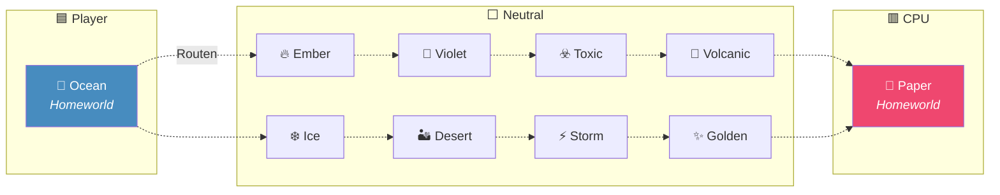
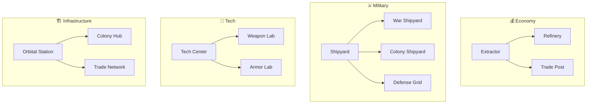
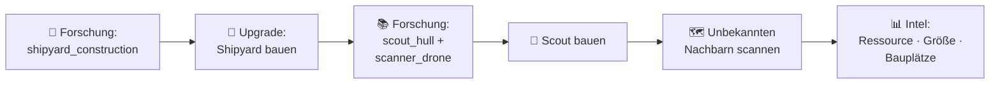
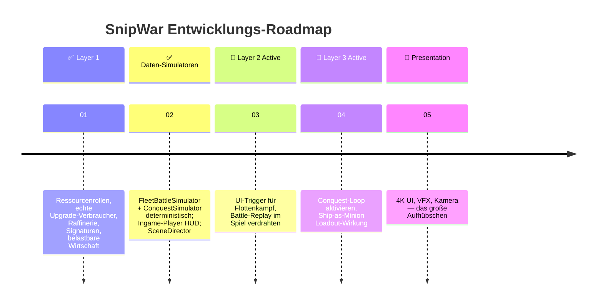
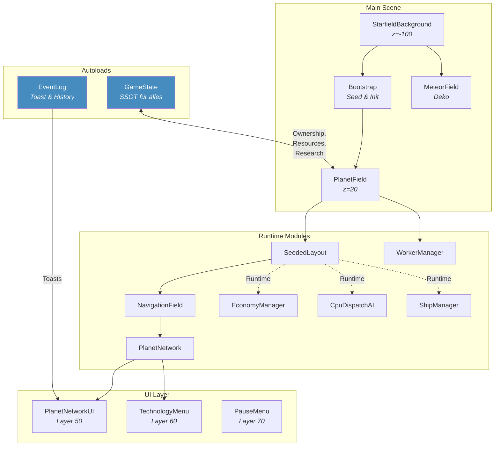

<div align="center">

<pre>
 ███████╗███╗   ██╗██╗██████╗ ██╗    ██╗ █████╗ ██████╗
 ██╔════╝████╗  ██║██║██╔══██╗██║    ██║██╔══██╗██╔══██╗
 ███████╗██╔██╗ ██║██║██████╔╝██║ █╗ ██║███████║██████╔╝
 ╚════██║██║╚██╗██║██║██╔═══╝ ██║███╗██║██╔══██║██╔══██╗
 ███████║██║ ╚████║██║██║     ╚███╔███╔╝██║  ██║██║  ██║
 ╚══════╝╚═╝  ╚═══╝╚═╝╚═╝      ╚══╝╚══╝ ╚═╝  ╚═╝╚═╝  ╚═╝
 ━━━━━━━━━━━━━━━━━━━━━━━━━━━━━━━━━━━━━━━━━━━━━━━━━━━━━━
 I R O N   F R O N T I E R
</pre>

# SnipWar — Iron Frontier

### *Ein Strategiespiel, das behauptet, bald fertig zu sein. Seit Patch 0.1.*

[](https://godotengine.org/)
[](#-status--build-01)
[-ef476f?style=for-the-badge)](#-transmission--01--die-vision)
[](#)
[](#)

> **Die Galaxie ist kein Schlachtfeld. Sie ist die Waffe.**
>
> *— Jemand, der offensichtlich noch nie versucht hat, zehn Planeten mit fünf Ressourcen auszubalancieren.*

</div>

---

## 📡 Was ist SNIPWAR?

Hinter dem knackigen Namen steckt mehr als ein Arbeitstitel — es ist ein Akronym. Natürlich.

| | | |
|:---:|:---|:---|
| **S** | **Strategische** | Overworld als Entscheidungsebene — nicht als Ladescreen |
| **N** | **Nebel-Imperien** | Zehn Welten im Nebel, zwei davon bilden sich ein, wichtig zu sein |
| **I** | **Integrierte** | Wirtschaft, Forschung, Transit — alles in einem `GameState`, ob es will oder nicht |
| **P** | **Planeten-** | Upgrades, Details, Orbits — jeder Planet ist sein eigenes kleines Drama |
| **W** | **Worker-** | K=1, M=5, L=100. Ja, 100 Worker in einem Cluster. Ambitioniert? Vielleicht. |
| **A** | **Allianz-** | …okay, Allianzen gibt es noch nicht. Aber Fraktionen! Das zählt. |
| **R** | **Routen** | AStar2D über Moon/Comet-Waypoints. Die Karte *ist* das Spiel. |

> [!TIP]
> Das Akronym war definitiv von Anfang an geplant und nicht nachträglich konstruiert. Definitiv.

---

## 🔭 TRANSMISSION / 01 — DIE VISION

SnipWar ist ein strategischer Overworld-Prototyp mit klaren Silhouetten, sichtbaren Routen und einer Wirtschaft, die *theoretisch* in epische Flotten- und Planetenkonflikte münden soll. Praktisch ist es aktuell ein sehr ambitionierter Karten-, Transit-, Ressourcen-, Forschungs- und Upgrade-Kern.

Die Endfassung denkt in **4K** — nicht als bloße Auflösung, sondern als Raum für Details, lesbare Kampfzonen und Einheiten, die man ohne Lupe erkennt. Die aktuelle technische Basis bleibt bescheiden bei 960×540. 4K ist ein Versprechen an die Zukunft, kein Versprechen an das nächste Commit.

> [!NOTE]
> **Stilrichtung:** Papercraft-Comic. Klare SVG-Silhouetten, Zellschattierung, begrenzte Farbpaletten. Wir malen die Zukunft mit Vektorgrafiken — weil wir es können, nicht weil es einfacher wäre.

---

## 🪐 DAS THEATER — Zehn Welten, ein Chaos

Der aktive Katalog enthält exakt zehn Planeten. Keiner davon wurde gefragt, ob er mitmachen will.



<details>
<summary>📐 <b>Technische Details für Leute, die Spaß an Seed-Deterministik haben</b></summary>

| Eigenschaft | Default-Szenario | Frontier Ring |
|:---|:---|:---|
| **Viewport** | 960 × 540 | 1920 × 1080 |
| **Seed** | Zufällig pro Lauf | Fester Map-Seed |
| **Routing** | `all_planets` — go anywhere | `neighbors_only` — Nachbarschaftspolitik |
| **XL-Welten** | 2 | 2 |
| **L-Welten** | 1 | 1 |
| **Variable** | 7 | 7 |

- Layout und Größenverteilung: **seed-deterministisch** (gleicher Seed = gleiche Karte, versprochen)
- PlanetDetails: seed-basiert generiert. Toxic hat Spezialbehandlung (Satellit + Asteroidengürtel garantiert — Toxic ist besonders)
- Navigation: Moon/Comet-Waypoints zwischen Layout-Nachbarn, AStar2D-Routing über das gesamte Netz
- Meteore: Vordergrund-Dekoration, respawnen innerhalb der WorldConfig-Grenzen (sie tun niemandem weh, sie sind nur hübsch)

</details>

---

## 🎮 WAS HEUTE SPIELBAR IST

> *"Für einen Prototypen ist hier verdächtig viel los."* — Ich, zu mir selbst, um 3 Uhr morgens.

### 🗺️ Karte & Transit

| Feature | Details |
|:---|:---|
| **Planetenauswahl** | Klick = Panel, Rechtsklick = Kontextmenü mit Schnellaktionen |
| **Missionsarten** | `military` · `colony` · `cargo` · `collect` |
| **Worker-Slider** | Wähle, wie viele du opf— ähm, entsendest |
| **Flugzeitvorschau** | Live-Berechnung, synchron mit dem tatsächlichen Transit |
| **Routing** | AStar2D über Waypoints mit sichtbarer Linienanimation |
| **Cluster-Packing** | Largest-first: K=1, M=5, L=100 — deterministische V-Formation |
| **Ankunft** | Verstärkung, Abwehr oder Eroberung — simpel, aber es funktioniert |
| **CPU-Gegner** | Timer-basierter Dispatcher mit Colony→Cargo→Military Priorität |

<details>
<summary>✈️ <b>Flugzeit-Formel (für die Mathematisch Neugierigen)</b></summary>

```
Flugzeit = (distance / 100) × 8 × (1 + 0.05 × √(max(unit_count − 1, 0)))
		   ÷ source_transfer_speed_multiplier
```

Ja, größere Gruppen fliegen langsamer. Das ist Physik. Oder Balancing. Oder beides.

</details>

---

### 💎 Ressourcen & Wirtschaft

Fünf unsichtbare `GameResource`-Typen treiben die Wirtschaft an:

```
⚡ Energy   🌿 Biomass   💠 Rare   🧪 Volatile   🔩 Material
```

> [!IMPORTANT]
> Ressourcen werden **nicht** aus Planetentypen abgeleitet. Ember produziert nicht automatisch Energie, nur weil es brennt. Die Zuordnung ist seed-deterministisch und fair — die Homeworlds bekommen unterschiedliche Ressourcen, der Rest wird round-robin verteilt.

| System | Status |
|:---|:---|
| Seed-Deal | ✅ Deterministisch über aktiven Katalog |
| Faction-Vaults | ✅ Getrennte Konten pro Fraktion |
| Passive Produktion | ✅ Größenabhängig + Upgrade-Traits + planetare Tech |
| Worker-Automation | 🔒 Erst nach Forschung `worker_automation` |
| Sammel-Einkommen | ✅ Persistente Gatherer auf gescannten neutralen Planeten |
| Overdraft-Schutz | ✅ `spend_faction_resource()` sagt "Nein" statt "Minus" |

---

### 🔬 Upgrades & Forschung

**13 Planet-Upgrades** in vier Zweigen — weil ein Technologiebaum ohne vier Zweige kein richtiger Baum ist:



<details>
<summary>📋 <b>Trait-Effekte — was die Upgrades tatsächlich tun</b></summary>

| Trait | Wirkung | Anmerkung |
|:---|:---|:---|
| `production_boost` | Erhöht passive Ressourcenproduktion | ✅ Aktiver Verbraucher |
| `worker_spawn_bonus` | Schnellere Worker-Produktion | ✅ Aktiver Verbraucher |
| `defense_rating` | Verteidigungswert bei Angriffen | ✅ Aktiver Verbraucher |
| `cluster_tier_bonus` | Größere sichtbare Cluster | ⚠️ Nur visuell |
| `transfer_speed_multiplier` | Schnellerer Transit | ✅ Aktiver Verbraucher |
| `maintenance` | Laufende Kosten | ✅ Best-effort (kein Bankrott) |
| `perimeter_slots_bonus` | Mehr Verteidigungsslots | 🔮 Datenfeld für Layer 3 |
| `range_bonus` | Erweiterte Reichweite | 🔮 Datenfeld für Layer 3 |

</details>

---

### 🚀 Scouts & Schiffsbuilder

> *"Wir haben einen Schiffsbuilder. Er baut Schiffe. Die meisten davon fliegen nur im Menü."*

Der **Scanner-Scout** ist der einzige tatsächlich fliegende Schiffstyp:



Der **modulare Ship Builder** kann Hüllen, Scanner und Module kaufen, zu Assemblies kombinieren und wieder zerlegen. Diese Assemblies sind aktuell **Inventar- und Display-Zustand** — hübsch anzusehen, aber noch nicht einsatzbereit. Baby steps.

---

### 🖥️ UI & Systeme

| Komponente | Layer | Beschreibung |
|:---|:---:|:---|
| **PlanetNetworkUI** | 50 | Panel + VaultBar — wo die Entscheidungen fallen |
| **TechnologyMenu** | 60 | SHIPS / MECH / PLANET Tabs — wo die Träume leben |
| **PauseMenu** | 70 | ESC drücken, Kaffee holen, weitermachen |
| **EventLog** | — | Scan-Reports, Factory-Events, Export nach `player.log` |
| **MessageFeed** | — | Toast-Nachrichten — dezent, aber bestimmt |

> [!NOTE]
> Das Pause-Menü pausiert nur, wenn weder Planet-Panel noch Tech-Menü offen sind. Multitasking ist eine Illusion.

---

## 📊 STATUS / BUILD 0.1

```
 ██████████████████████████████░░░  ~90% Layer 1  — Kern vollständig, Balancing läuft
 ██████████████████░░░░░░░░░░░░░░░  ~55% Layer 2  — Simulator + Ingame-Player fertig, UI-Integration pending
 ███████░░░░░░░░░░░░░░░░░░░░░░░░░░  ~20% Layer 3  — Conquest-Simulator läuft, kein aktiver Loop
 ████████░░░░░░░░░░░░░░░░░░░░░░░░░  ~25% 4K Presentation
```

Der implementierte Kern ist *deutlich* größer als ein reiner Karten-Vertical-Slice — aber auch *deutlich* kleiner als ein fertiger 4X-Titel. Das ist der sweet spot, in dem sich Prototypen am wohlsten fühlen.

> [!IMPORTANT]
> Der zentrale automatisierte Nachweis ist die **persistente Headless-Preflight-Suite** in [`preflight.gd`](scripts/preflight.gd). Sie testet Scene-Boot, Kataloge, Ressourcen, Seed-Variation, Navigation, UI, Upgrades, Missionen, Scouts, Ship-Builder, EventLog und mehr.

---

## 🚫 NOCH NICHT DRIN — oder: die ehrliche Stunde

> *Transparenz ist, wenn man zugibt, was noch fehlt — und trotzdem stolz auf den Rest ist.*

<details>
<summary><b>Was fehlt vs. was schon läuft</b></summary>

| Feature | Status |
|:---|:---:|
| Deterministische Flottensimulation (`FleetBattleSimulator`) | ✅ Daten-Layer fertig |
| Conquest-Simulator (Tower Defense + Ship-as-Minion) | ✅ Daten-Layer fertig |
| Ingame-Player (Play/Pause/Scrub/Speed/Skip) | ✅ HUD-Klasse fertig |
| Raffinerie-Konvertierung (Material + Energy → Rare) | ✅ Aktiv im Economy-Tick |
| Ressourcen-Signaturen pro Planetentyp | ✅ Seed-deterministisch |
| Perimeter-Slots + Reichweite als Upgrade-Trait | ✅ Datenfeld aktiv |
| SceneDirector (Screen-Fade-Transition) | ✅ Layer 95 |
| FloatingText (Combat-Damage-Popups) | ✅ Tween-Lifecycle |
| Layer 2 → UI-Integration (Trigger aus Overworld) | ❌ Noch nicht verdrahtet |
| Layer 3 → aktiver Conquest-Loop | ❌ Noch nicht verdrahtet |
| Ship-Assembly-Traits im Kampf | ❌ Snapshot vorhanden, Wirkung pending |
| Mech-Klassen, Mech-Kampflogik | ❌ Layer 3 Zukunft |
| Siegbedingungen, Kampagnenprogression | ❌ Bewusst offen |
| Allianzen *(sorry, das „A" im Akronym)* | ❌ Ehrgeiz trifft Roadmap |

</details>

> 📄 Verbindliche Technik: [`DESIGN.md`](DESIGN.md)

---

## ⚙️ STARTUP SEQUENCE

> *Drei Schritte zum Glück. Vier, wenn man die Installation mitzählt.*

**Voraussetzungen:**

- [Godot 4.7](https://godotengine.org/download/archive/4.7.2-stable/) — andere Versionen auf eigene Gefahr
- Eine Umgebung, die den Godot-Projektstand ausführen kann (Low bar, versprochen)

**Projekt starten:**

```bash
# Option A: Die Zivilisierte
Godot öffnen → Projekt importieren → project.godot → F5

# Option B: Die Effiziente (Godot auf PATH oder GODOT_BIN setzen)
godot --path .
```

**Testen:**

```bash
# Smoke-Test: "Startet es überhaupt?"
godot --headless --path . --quit-after 2

# Preflight-Suite: "Funktioniert es auch wirklich?"
godot --headless --path . --script res://scripts/preflight.gd
```

> [!WARNING]
> Die Headless-Kommandos benötigen `godot` auf `PATH` oder `GODOT_BIN`. Ohne Binary keine Tests. Ohne Tests kein Vertrauen. Ohne Vertrauen keine Sterne. ⭐

---

## 🗺️ ROADMAP — Die nächsten Sprünge



---

## 🏗️ ARCHITEKTUR — Für die Neugierigen

<details>
<summary><b>Wer redet hier mit wem?</b></summary>



</details>

---

## 🎬 CALLSIGN

SnipWar ist kein fertiges Universum — das war es nie, und das ist okay. Der strategische Kern steht. Aus Ressourcenfluss, Forschung und Besitzwechsel muss jetzt ein Loop werden, der sich anfühlt wie ein Spiel und nicht wie eine Tabellenkalkulation mit Sternenhintergrund.

*Aber selbst diese Tabellenkalkulation hat verdammt gute Sterne.*

<div align="center">

---

**`CONNECT · DEPLOY · HOLD THE LINE`**

*Zehn Welten. Ein Code-Monolith. Keine sicheren Orbits.*

---

<sub>Gebaut mit Godot 4.7 · Angetrieben von Koffein und der Überzeugung, dass SVGs für alles reichen · © 2026</sub>

</div>
