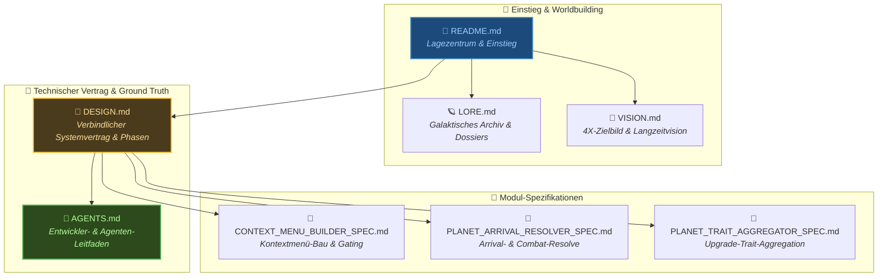

<div align="center">

```
╔══════════════════════════════════════════════════════════════╗
║                                                              ║
║   SNIPWAR // DOKUMENTATIONS-INDEX & ARCHITEKTUR-LANDKARTE    ║
║   KLASSIFIZIERUNG: ZENTRALE QUELLE DER WAHRHEIT             ║
║                                                              ║
╚══════════════════════════════════════════════════════════════╝
```

</div>

# SnipWar Dokumentations-Struktur & Zugehörigkeiten

Diese Übersicht konsolidiert und gliedert die zentralen Markdown-Dokumente (`.md`) des Repositories in thematische und funktionale Zugehörigkeiten. Öffentliche Dokumente beschreiben den verifizierten Laufzeitstand; historische Konzepte werden ausdrücklich als solche markiert.

---

## 🗺️ Übersicht der Dokumentations-Domänen



---

## 📂 Die 5 Zugehörigkeiten im Detail

### 1. Einstieg, Lagezentrum & Worldbuilding (Portal & Narrative)
*Zielgruppe: Spieler, Tester, Entwickler auf der Suche nach Kontext und Bedienung.*

| Dokument | Pfad | Zweck & Inhalt |
|:---|:---|:---|
| **Lagezentrum & Quickstart** | [`README.md`](../README.md) | Öffentlicher Einstiegspunkt, Terminal-Initialisierung, aufgeklärter Startausschnitt der prozeduralen Chunk-Welt, Ressourcen, Upgrades, Schiffe, Dispatch-UI, Preflight-Übersicht und Roadmap. |
| **Galaktisches Archiv** | [`LORE.md`](../LORE.md) | Worldbuilding, Hintergrund der Ocean-Koalition und des Paper-Kollektivs, Dossiers des initialen Kartenausschnitts, lokale Vorräte, Dispatch-Aufträge, Scan-Intel und Technologiedoktrin. |
| **Produkt- & 4X-Zielvision** | [`VISION.md`](../VISION.md) | Nicht-bindendes Zielbild für den vollständigen 4X-Kreislauf (`Wirtschaft → Expansion → Kontakt → Flottenkampf → Eroberung`). |

---

### 2. Technischer Systemvertrag (Authoritative Architecture Contract)
*Zielgruppe: Entwickler, Code-Reviewer, Engine-Architekten.*

| Dokument | Pfad | Zweck & Inhalt |
|:---|:---|:---|
| **System-Spezifikation** | [`DESIGN.md`](../DESIGN.md) | **Verbindlicher technischer MVP-Vertrag** (*„Code schlägt Dokument“*). Enthält deterministische Algorithmen (Flugzeit, Dispatch, Combat-Resolve), GameState-Fassadenarchitektur mit 4 Domänen-Managern, unendliche Chunk-Welt, aktuelle Layer-2/3-Replays und Feature-Matrix. |

---

### 3. Entwickler- & Agenten-Leitfaden (Operational Ground Truth)
*Zielgruppe: KI-Agenten und menschliche Entwickler vor jeder Code-Änderung.*

| Dokument | Pfad | Zweck & Inhalt |
|:---|:---|:---|
| **Agenten- & Entwicklerregeln** | [`AGENTS.md`](../AGENTS.md) | **Faktengetreue operative Leitlinien:** Godot-Headless-Regeln, modulares Preflight-Design (33 Constraints, `PreflightFixture`-Isolation, Seed `424242`), atomare Commit-Gruppen (`Change Together`), Godot-Fallstricke und unumgehbare Git-Hook-Kette. |

---

### 4. Modulspezifikationen (Deep Module Specifications)
*Zielgruppe: Entwickler, die isolierte Kern-Module warten oder erweitern.*

| Dokument | Pfad | Zweck & Inhalt |
|:---|:---|:---|
| **Context Menu Builder Spec** | [`scripts/objects/planets/CONTEXT_MENU_BUILDER_SPEC.md`](../scripts/objects/planets/CONTEXT_MENU_BUILDER_SPEC.md) | Architektur-Spezifikation für die Extraktion der Planeten-Rechtsklick-Menülogik aus `planet_network.gd`. |
| **Planet Arrival Resolver Spec** | [`scripts/objects/planets/PLANET_ARRIVAL_RESOLVER_SPEC.md`](../scripts/objects/planets/PLANET_ARRIVAL_RESOLVER_SPEC.md) | Architektur-Spezifikation für die Extraktion der Arrival-, Missions- und Konfliktauflösung aus `planet.gd`. |
| **Planet Trait Aggregator Spec** | [`scripts/objects/planets/PLANET_TRAIT_AGGREGATOR_SPEC.md`](../scripts/objects/planets/PLANET_TRAIT_AGGREGATOR_SPEC.md) | Architektur-Spezifikation für die Trait- und Upgrade-Bonus-Aggregation aus `planet.gd`. |

---

### 5. Lokale Tooling- & Agenten-Skills
*Zielgruppe: Agenten-Workflow.*

| Dokument | Pfad | Zweck & Inhalt |
|:---|:---|:---|
| **Freebuff Commit Skill** | [`.agents/skills/commit/SKILL.md`](../.agents/skills/commit/SKILL.md) | Automatisierter Commit-Workflow mit Dateibegründungen und Hook-Verifikation. |

---

## 🛡️ Dokumentations-Integritätsregeln

1. **Wahrheitsgebot:** Keine hypothetischen oder unvollständigen Features dürfen in `AGENTS.md`, `DESIGN.md` oder `README.md` als implementiert dokumentiert werden, wenn kein Laufzeitverbraucher und keine Preflight-Abdeckung existieren.
2. **Synchronisation bei Änderungen:** Änderungen an Schnittstellen müssen zeitgleich in Code, Preflight und dem zugehörigen Modulvertrag aktualisiert werden (siehe `Change/commit together` in `AGENTS.md`).
3. **Preflight-Konsistenz:** Die Anzahl der Constraints (aktuell **33 Constraints**) und die CLI-Flags (`--verbose`, `--fail-fast`, `--filter`, `--reverse`, `--list`) müssen über alle Dokumente einheitlich geführt werden.
